# Merchant Service - Technical Documentation

> **Version:** 1.0  
> **Last Updated:** 2026-02-14  
> **Author:** Senior Engineering Team  
> **Target Audience:** New Team Members

---

## 📑 Table of Contents

1. [Executive Summary](#1-executive-summary)
2. [Architecture Overview](#2-architecture-overview)
3. [Project Structure Deep Dive](#3-project-structure-deep-dive)
4. [Application Entry Point & CLI](#4-application-entry-point--cli)
5. [Layer-by-Layer Code Walkthrough](#5-layer-by-layer-code-walkthrough)
6. [Data Flow & Sequence Diagrams](#6-data-flow--sequence-diagrams)
7. [External Integrations Deep Dive](#7-external-integrations-deep-dive)
8. [Utility Packages (pkg/)](#8-utility-packages-pkg)
9. [Configuration & Environment](#9-configuration--environment)
10. [Development Patterns & Conventions](#10-development-patterns--conventions)
11. [API Reference](#11-api-reference)
12. [Database Schema](#12-database-schema)
13. [Testing Strategy](#13-testing-strategy)
14. [Troubleshooting & FAQ](#14-troubleshooting--faq)
15. [Deployment Guide](#15-deployment-guide)

---

## 1. Executive Summary

### 1.1 Apa itu Merchant Service?

**Merchant Service** adalah microservice Go yang mengelola informasi merchant, relasi merchant-produk, dan manajemen stok di seluruh warehouse. Service ini berperan sebagai pusat operasional untuk kebutuhan merchant-related dalam ekosistem **Micro-Warehouse**.

### 1.2 Key Responsibilities

| Responsibility | Deskripsi |
|---------------|-----------|
| **Merchant CRUD** | Create, Read, Update, Delete data merchant |
| **Merchant-Product Management** | Mengelola asosiasi merchant dengan produk |
| **Stock Tracking** | Tracking stok per merchant per warehouse |
| **File Upload** | Handle upload foto merchant ke Supabase Storage |
| **Async Stock Reduction** | Mengurangi stok via RabbitMQ events |

### 1.3 Posisi dalam Ekosistem Micro-Warehouse

```
┌─────────────────────────────────────────────────────────────────┐
│                    MICRO-WAREHOUSE ECOSYSTEM                     │
├─────────────────────────────────────────────────────────────────┤
│                                                                  │
│  ┌──────────────┐    ┌──────────────┐    ┌──────────────┐       │
│  │ User Service │    │Product Service│   │Warehouse     │       │
│  │   :8081      │◄──►│   :8082      │◄──►│Service :8083 │       │
│  └──────┬───────┘    └──────┬───────┘    └──────┬───────┘       │
│         │                   │                   │               │
│         └───────────────────┼───────────────────┘               │
│                             │                                   │
│                             ▼                                   │
│                    ┌─────────────────┐                         │
│                    │  THIS SERVICE   │                         │
│                    │Merchant Service │                         │
│                    │    :8084        │                         │
│                    └────────┬────────┘                         │
│                             │                                   │
│              ┌──────────────┼──────────────┐                   │
│              ▼              ▼              ▼                   │
│        ┌─────────┐    ┌─────────┐    ┌──────────┐             │
│        │PostgreSQL│   │  Redis  │    │ RabbitMQ │             │
│        └─────────┘    └─────────┘    └──────────┘             │
│                                                                  │
│        ┌─────────────────────────────────────────┐              │
│        │         Supabase Storage                │              │
│        │      (Merchant Photos)                  │              │
│        └─────────────────────────────────────────┘              │
│                                                                  │
└─────────────────────────────────────────────────────────────────┘
```

### 1.4 Tech Stack Overview

| Komponen | Teknologi | Versi |
|----------|-----------|-------|
| **Language** | Go | 1.24.7 |
| **Web Framework** | Fiber | v2 |
| **ORM** | GORM | Latest |
| **Database** | PostgreSQL | 14+ |
| **Cache** | Redis | 6+ |
| **Message Queue** | RabbitMQ | 3.8+ |
| **File Storage** | Supabase Storage | - |
| **Config Management** | Viper + Cobra | - |
| **Validation** | go-playground/validator | v10 |
| **Logging** | rs/zerolog | - |

### 1.5 Prerequisites untuk Development

Sebelum mulai development, pastikan sudah install:

- [ ] Go 1.24.7+
- [ ] PostgreSQL running on port **5435**
- [ ] Redis running on port **6379**
- [ ] RabbitMQ running on port **5672**
- [ ] User Service running on port **8081**
- [ ] Product Service running on port **8082**
- [ ] Warehouse Service running on port **8083**

---

## 2. Architecture Overview

### 2.1 High-Level Architecture

Merchant Service mengikuti pola **Clean Architecture / Layered Architecture** dengan 4 layer utama:

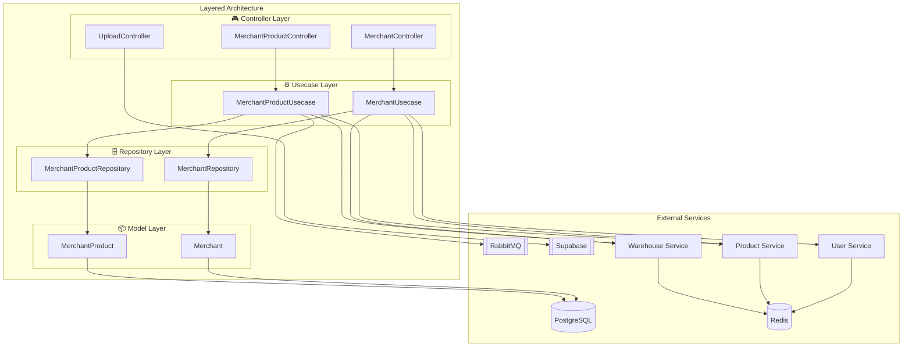

### 2.2 Request Lifecycle

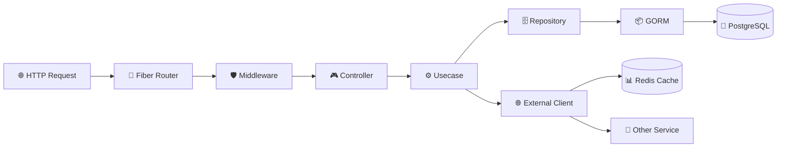

**Flow Detail:**
1. **HTTP Request** masuk ke Fiber server
2. **Router** mencocokkan path dengan handler
3. **Middleware** (CORS, Logger, Recover) diproses
4. **Controller** menerima request, validasi input
5. **Usecase** menjalankan business logic
6. **Repository** melakukan operasi database
7. **GORM** mengconvert ke SQL query
8. **PostgreSQL** menyimpan/retrieve data
9. **External Client** (jika perlu) mengambil data dari service lain
10. **Redis Cache** mengoptimasi external calls

### 2.3 Async Event Flow (RabbitMQ)

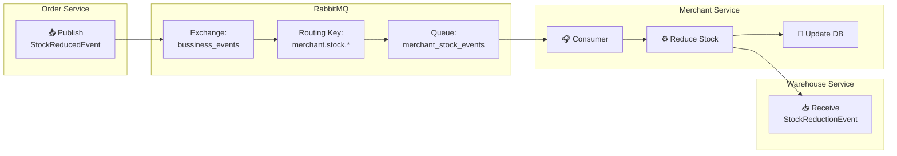

### 2.4 External Service Integration Map

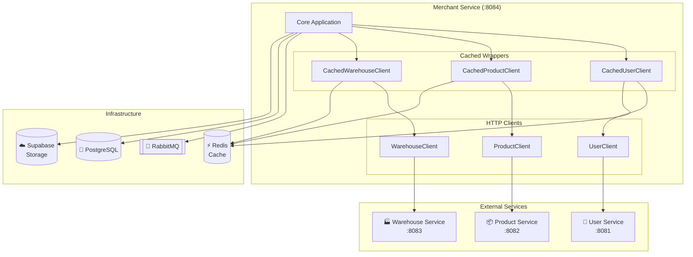

---

## 3. Project Structure Deep Dive

### 3.1 Folder-by-Folder Explanation

```
merchant-service/
│
├── 📁 cmd/                          # Cobra CLI commands
│   ├── root.go                      # Root command & Viper config init
│   └── start.go                     # Start server command
│
├── 📁 app/                          # Application bootstrap
│   ├── app.go                       # HTTP server setup, middleware, graceful shutdown
│   ├── container.go                 # Dependency injection container (DI wiring)
│   └── routes.go                    # Route definitions & grouping
│
├── 📁 configs/                      # Configuration management
│   └── config.go                    # Config structs & env mapping dengan Viper
│
├── 📁 controller/                   # HTTP handlers (Controllers)
│   ├── merchant_controller.go       # Merchant CRUD handlers
│   ├── merchant_product_controller.go  # Merchant-Product handlers
│   ├── upload_controller.go         # File upload handler
│   ├── 📁 request/                  # Request DTOs
│   │   ├── merchant_request.go
│   │   └── merchant_product_request.go
│   └── 📁 response/                 # Response DTOs
│       ├── merchant_response.go
│       └── merchant_product_response.go
│
├── 📁 usecase/                      # Business logic layer
│   ├── merchant_usecase.go          # Merchant business logic
│   └── merchant_product_usecase.go  # Merchant-Product business logic
│
├── 📁 repository/                   # Data access layer
│   ├── merchant_repository.go       # Merchant DB operations
│   └── merchant_product_repository.go  # Merchant-Product DB operations
│
├── 📁 model/                        # Domain models (GORM entities)
│   ├── merchant_model.go            # Merchant entity
│   └── merchant_product_model.go    # MerchantProduct entity
│
├── 📁 database/                     # Database connection
│   └── postgres_database.go         # PostgreSQL connection & auto-migration
│
├── 📁 pkg/                          # Shared packages
│   ├── 📁 conv/                     # Type conversions
│   │   └── conv.go                  # Password hashing & string conversion
│   ├── 📁 httpclient/               # External service clients
│   │   ├── user_client.go           # User Service client
│   │   ├── product_client.go        # Product Service client
│   │   ├── warehouse_client.go      # Warehouse Service client
│   │   ├── cached_user_client.go    # Cached User client
│   │   ├── cached_product_client.go # Cached Product client
│   │   ├── cached_warehouse_client.go  # Cached Warehouse client
│   │   └── response_mapper.go       # Response mapping utilities
│   ├── 📁 pagination/               # Pagination utilities
│   │   └── pagination.go            # Pagination calculation
│   ├── 📁 rabbitmq/                 # RabbitMQ producer/consumer
│   │   ├── rabbitmq_service.go      # Producer untuk publish events
│   │   └── consumer.go              # Consumer untuk stock events
│   ├── 📁 redis/                    # Redis client wrapper
│   │   └── redis_client.go          # Redis operations (Get, Set, Delete, etc)
│   ├── 📁 storage/                  # File storage (Supabase)
│   │   ├── supabase_storage.go      # Supabase Storage client
│   │   └── file_upload_helper.go    # File validation & upload helper
│   └── 📁 validator/                # Request validation
│       └── request_validator.go     # Struct validation dengan go-playground
│
├── main.go                          # Application entry point
├── go.mod                           # Go module definition
├── go.sum                           # Go module checksums
└── .env                             # Environment variables (gitignored)
```

### 3.2 Key Files Analysis

#### 3.2.1 `app/container.go` - Dependency Injection Hub

File ini adalah **jantung dari DI (Dependency Injection)**. Semua dependencies diwire di sini menggunakan constructor injection.

**Dependency Graph:**

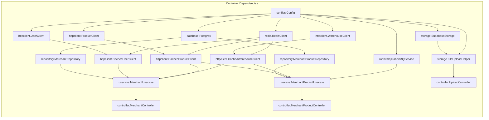

#### 3.2.2 `app/routes.go` - Route Definitions

Semua endpoint didefinisikan di sini dengan grouping:

```go
// Struktur Routing:
/api/v1
├── /merchants                    [MerchantController]
│   ├── POST   /                 CreateMerchant
│   ├── GET    /                 GetAllMerchants
│   ├── GET    /:id              GetMerchantById
│   ├── PUT    /:id              UpdateMerchant
│   └── DELETE /:id              DeleteMerchant
│
├── /merchant-products            [MerchantProductController]
│   ├── POST   /                 CreateMerchantProduct
│   ├── GET    /                 GetMerchantProducts
│   ├── GET    /:id              GetMerchantProductByID
│   ├── GET    /barcode/:barcode GetMerchantProductByBarcode
│   ├── PUT    /:id              UpdateMerchantProduct
│   ├── DELETE /:id              DeleteMerchantProduct
│   ├── DELETE /product/:product_id DeleteAllProductMerchantProducts
│   └── GET    /:product_id/total-stock GetProductTotalStock
│
└── /upload-merchant              [UploadController]
    └── POST   /                 UploadMerchantPhoto
```

#### 3.2.3 `database/postgres_database.go` - Database Connection

Berisi logic untuk:
- Connection string formatting
- GORM database opening
- **Auto-migration** untuk model Merchant dan MerchantProduct
- Connection pooling configuration (MaxIdleConns, MaxOpenConns)

---

## 4. Application Entry Point & CLI

### 4.1 `main.go` - Bootstrap

```go
package main

import "micro-warehouse/merchant-service/cmd"

func main() {
    cmd.Execute()
}
```

File ini sangat simple, hanya memanggil `cmd.Execute()` untuk menjalankan Cobra CLI.

### 4.2 `cmd/root.go` - Cobra & Viper Setup

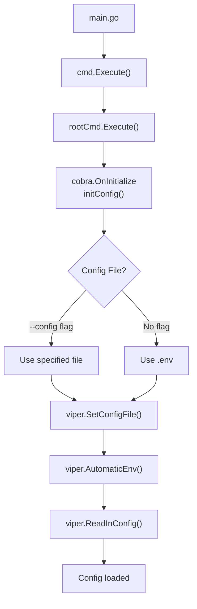

**Key Points:**
- Menggunakan **Cobra** untuk CLI command management
- Menggunakan **Viper** untuk configuration management
- Support custom config file via `--config` flag
- Default config file: `.env`
- `AutomaticEnv()` mengizinkan override dengan environment variables

### 4.3 `cmd/start.go` - Start Server Command

Command untuk menjalankan HTTP server:

```go
var startCmd = &cobra.Command{
    Use:   "start",
    Short: "Start the HTTP server",
    Run: func(cmd *cobra.Command, args []string) {
        app.RunServer()
    },
}
```

**Usage:**
```bash
# Default (menggunakan .env)
go run main.go

# Atau explicit
go run main.go start

# Dengan custom config
go run main.go --config /path/to/config.env
```

---

## 5. Layer-by-Layer Code Walkthrough

### 5.1 Controller Layer

Controllers adalah entry point untuk HTTP requests. Mereka bertanggung jawab untuk:
- Menerima dan parse request
- Validasi input
- Memanggil usecase
- Format response
- Error handling

#### 5.1.1 MerchantController

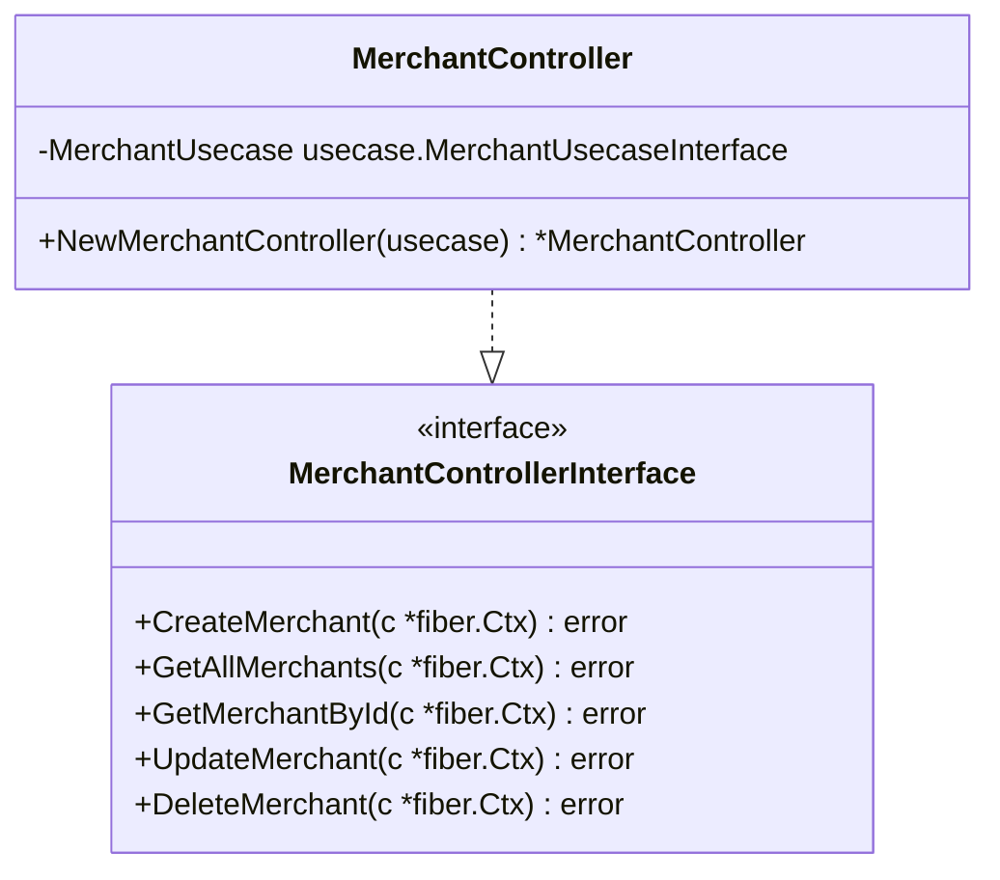

**Methods:**

| Method | Endpoint | Deskripsi |
|--------|----------|-----------|
| `CreateMerchant` | POST /merchants | Membuat merchant baru |
| `GetAllMerchants` | GET /merchants | List merchants dengan pagination, search, sort |
| `GetMerchantById` | GET /merchants/:id | Get merchant by ID dengan products |
| `UpdateMerchant` | PUT /merchants/:id | Update merchant |
| `DeleteMerchant` | DELETE /merchants/:id | Soft delete merchant |

#### 5.1.2 MerchantProductController

| Method | Endpoint | Deskripsi |
|--------|----------|-----------|
| `CreateMerchantProduct` | POST /merchant-products | Buat asosiasi merchant-produk |
| `GetMerchantProducts` | GET /merchant-products | List semua merchant-product |
| `GetMerchantProductByID` | GET /merchant-products/:id | Get by ID |
| `GetMerchantProductByBarcode` | GET /merchant-products/barcode/:barcode | Get by barcode |
| `UpdateMerchantProduct` | PUT /merchant-products/:id | Update stock |
| `DeleteMerchantProduct` | DELETE /merchant-products/:id | Delete asosiasi |
| `DeleteAllProductMerchantProducts` | DELETE /merchant-products/product/:product_id | Delete semua untuk product |
| `GetProductTotalStock` | GET /merchant-products/:product_id/total-stock | Total stock product |

#### 5.1.3 UploadController

```go
func (c *UploadController) UploadMerchantPhoto(ctx *fiber.Ctx) error {
    // 1. Parse multipart form
    // 2. Extract file
    // 3. Call FileUploadHelper
    // 4. Return upload result
}
```

#### 5.1.4 Request DTOs

**CreateMerchantRequest:**
```go
type CreateMerchantRequest struct {
    Name     string `json:"name" validate:"required"`
    KeeperID uint   `json:"keeper_id" validate:"required"`
    Address  string `json:"address" validate:"required"`
    Phone    string `json:"phone" validate:"required"`
    Photo    string `json:"photo" validate:"required"`
}
```

**CreateMerchantProductRequest:**
```go
type CreateMerchantProductRequest struct {
    MerchantID  uint `json:"merchant_id" validate:"required"`
    ProductID   uint `json:"product_id" validate:"required"`
    WarehouseID uint `json:"warehouse_id" validate:"required"`
    Stock       int  `json:"stock" validate:"required,min=0"`
}
```

#### 5.1.5 Response DTOs

**MerchantResponse:**
```go
type MerchantResponse struct {
    ID        uint      `json:"id"`
    Name      string    `json:"name"`
    Address   string    `json:"address"`
    Photo     string    `json:"photo"`
    Phone     string    `json:"phone"`
    KeeperID  uint      `json:"keeper_id"`
    Keeper    any       `json:"keeper"`      // Dari User Service
    CreatedAt time.Time `json:"created_at"`
    UpdatedAt time.Time `json:"updated_at"`
}
```

**MerchantProductResponse:**
```go
type MerchantProductResponse struct {
    ID                   uint   `json:"id"`
    MerchantID           uint   `json:"merchant_id"`
    ProductID            uint   `json:"product_id"`
    ProductName          string `json:"product_name"`
    ProductAbout         string `json:"product_about"`
    ProductPhoto         string `json:"product_photo"`
    ProductPrice         int    `json:"product_price"`
    ProductCategory      string `json:"product_category"`
    ProductCategoryPhoto string `json:"product_category_photo"`
    WarehouseID          uint   `json:"warehouse_id"`
    WarehouseName        string `json:"warehouse_name"`
    WarehousePhoto       string `json:"warehouse_photo"`
    WarehousePhone       string `json:"warehouse_phone"`
    Stock                int    `json:"stock"`
}
```

### 5.2 Usecase Layer

Usecase berisi **business logic**. Mereka mengkoordinasikan antara repository dan external services.

#### 5.2.1 MerchantUsecase

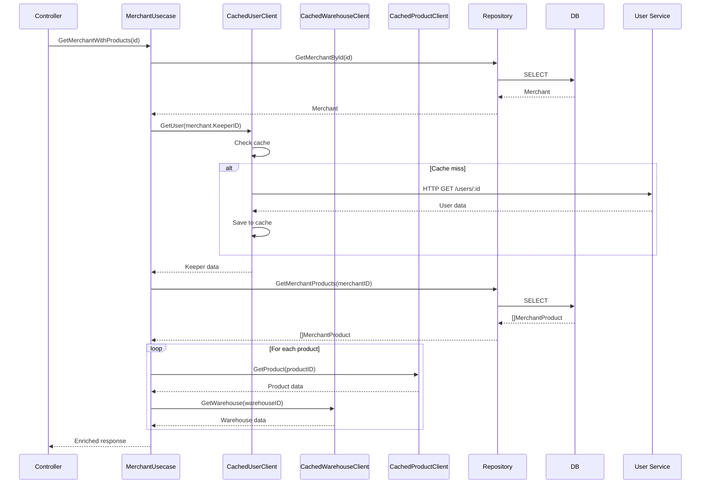

**Key Methods:**

| Method | Deskripsi |
|--------|-----------|
| `CreateMerchant` | Create merchant dengan validasi keeper exists |
| `GetAllMerchants` | List dengan pagination & search |
| `GetMerchantById` | Get merchant dengan enrich keeper data |
| `GetMerchantWithProducts` | Get merchant dengan products enrich dari external |
| `UpdateMerchant` | Update merchant data |
| `DeleteMerchant` | Soft delete merchant |

#### 5.2.2 MerchantProductUsecase

| Method | Deskripsi |
|--------|-----------|
| `CreateMerchantProduct` | Buat asosiasi dengan validasi product & warehouse exists |
| `GetMerchantProducts` | List dengan enrich product & warehouse data |
| `GetMerchantProductByID` | Get single dengan enrich data |
| `GetMerchantProductByBarcode` | Get by product barcode |
| `UpdateMerchantProduct` | Update stock |
| `DeleteMerchantProduct` | Delete single asosiasi |
| `DeleteAllProductMerchantProducts` | Delete semua untuk product |
| `GetProductTotalStock` | Calculate total stock across merchants |
| `ReduceStock` | Kurangi stock (dipanggil oleh RabbitMQ consumer) |

**Pattern Enrich Data dari External:**

```go
func (u *MerchantUsecase) enrichMerchantData(ctx context.Context, merchants []model.Merchant) []response.MerchantResponse {
    // 1. Ambil data dari external services
    // 2. Merge dengan merchant data
    // 3. Return enriched response
}
```

### 5.3 Repository Layer

Repository bertanggung jawab untuk **data access**. Mereka berinteraksi langsung dengan database via GORM.

#### 5.3.1 MerchantRepository

**Interface:**
```go
type MerchantRepositoryInterface interface {
    CreateMerchant(ctx context.Context, merchant model.Merchant) (model.Merchant, error)
    GetAllMerchants(ctx context.Context, page, limit int, search, sortBy, sortOrder string) ([]model.Merchant, int64, error)
    GetMerchantById(ctx context.Context, id uint) (model.Merchant, error)
    UpdateMerchant(ctx context.Context, id uint, merchant model.Merchant) (model.Merchant, error)
    DeleteMerchant(ctx context.Context, id uint) error
}
```

**Pattern Context Cancellation Check:**

Semua repository methods menggunakan pattern ini untuk handle context cancellation:

```go
func (r *MerchantRepository) GetMerchantById(ctx context.Context, id uint) (model.Merchant, error) {
    // Check context cancellation
    select {
    case <-ctx.Done():
        log.Errorf("[MerchantRepository] GetMerchantById - 1: %v", ctx.Err())
        return model.Merchant{}, ctx.Err()
    default:
        // Continue with DB operation
    }
    
    var merchant model.Merchant
    result := r.db.WithContext(ctx).First(&merchant, id)
    if result.Error != nil {
        log.Errorf("[MerchantRepository] GetMerchantById - 2: %v", result.Error)
        return model.Merchant{}, result.Error
    }
    
    return merchant, nil
}
```

#### 5.3.2 MerchantProductRepository

**Interface:**
```go
type MerchantProductRepositoryInterface interface {
    Create(ctx context.Context, mp model.MerchantProduct) (model.MerchantProduct, error)
    GetByID(ctx context.Context, id uint) (model.MerchantProduct, error)
    GetByMerchantID(ctx context.Context, merchantID uint) ([]model.MerchantProduct, error)
    GetByProductID(ctx context.Context, productID uint) ([]model.MerchantProduct, error)
    GetByBarcode(ctx context.Context, barcode string) (model.MerchantProduct, error)
    GetAll(ctx context.Context) ([]model.MerchantProduct, error)
    Update(ctx context.Context, id uint, mp model.MerchantProduct) (model.MerchantProduct, error)
    Delete(ctx context.Context, id uint) error
    DeleteByProductID(ctx context.Context, productID uint) error
    GetTotalStock(ctx context.Context, productID uint) (int, error)
    ReduceStock(ctx context.Context, merchantID, productID uint, quantity int64) error
}
```

**Key Query Patterns:**

1. **Pagination & Search:**
```go
query := r.db.WithContext(ctx).Model(&model.Merchant{})
if search != "" {
    query = query.Where("name ILIKE ? OR address ILIKE ?", "%"+search+"%", "%"+search+"%")
}
query = query.Order(fmt.Sprintf("%s %s", sortBy, sortOrder))
query = query.Offset((page - 1) * limit).Limit(limit)
```

2. **Soft Delete:**
```go
// Menggunakan GORM soft delete dengan DeletedAt field
result := r.db.WithContext(ctx).Delete(&model.Merchant{}, id)
```

3. **Stock Reduction:**
```go
func (r *MerchantProductRepository) ReduceStock(ctx context.Context, merchantID, productID uint, quantity int64) error {
    return r.db.WithContext(ctx).Model(&model.MerchantProduct{}).
        Where("merchant_id = ? AND product_id = ?", merchantID, productID).
        UpdateColumn("stock", gorm.Expr("stock - ?", quantity)).Error
}
```

### 5.4 Model Layer

Models adalah **GORM entities** yang merepresentasikan tabel database.

#### 5.4.1 Merchant Model

```go
type Merchant struct {
    ID        uint      `gorm:"primaryKey"`
    Name      string    `gorm:"type:varchar(100);not null"`
    Address   string    `gorm:"type:text"`
    Photo     string
    Phone     string
    KeeperID  uint      `gorm:"not null"`
    CreatedAt time.Time
    UpdatedAt *time.Time
    DeletedAt *time.Time `gorm:"index"`
    
    // Relations
    MerchantProducts []MerchantProduct
}
```

**GORM Tags:**
- `primaryKey`: Field ini adalah primary key
- `type:varchar(100)`: Tipe data string dengan max length 100
- `not null`: Kolom tidak boleh NULL
- `index`: Buat index untuk field ini (berguna untuk soft delete)

#### 5.4.2 MerchantProduct Model

```go
type MerchantProduct struct {
    ID          uint      `gorm:"primaryKey"`
    MerchantID  uint      `gorm:"not null;index"`
    ProductID   uint      `gorm:"not null;index"`
    WarehouseID uint      `gorm:"not null;index"`
    Stock       int       `gorm:"not null;default:0"`
    CreatedAt   time.Time
    UpdatedAt   *time.Time
    DeletedAt   *time.Time `gorm:"index"`
    
    // Relations
    Merchant Merchant
}
```

**Indexes:**
- `MerchantID`: Untuk query cepat per merchant
- `ProductID`: Untuk query cepat per product
- `WarehouseID`: Untuk query cepat per warehouse

---

## 6. Data Flow & Sequence Diagrams

### 6.1 Create Merchant Flow

```mermaid
sequenceDiagram
    autonumber
    participant Client
    participant MC as MerchantController
    validator as Validator
    participant MU as MerchantUsecase
    participant UserC as CachedUserClient
    participant MR as MerchantRepository
    participant DB as PostgreSQL
    
    Client->>MC: POST /api/v1/merchants
    Note right of Client: Body: {name, keeper_id, address, phone, photo}
    
    MC->>validator: Validate(request)
    alt Validation Failed
        validator-->>MC: Return validation errors
        MC-->>Client: 400 Bad Request
    end
    
    MC->>MU: CreateMerchant(ctx, request)
    
    MU->>UserC: GetUser(request.KeeperID)
    Note right of MU: Verify keeper exists
    
    alt Keeper Not Found
        UserC-->>MU: Error: Not Found
        MU-->>MC: Return error
        MC-->>Client: 404 Keeper not found
    end
    
    UserC-->>MU: Keeper data
    
    MU->>MR: CreateMerchant(ctx, merchant)
    
    MR->>DB: INSERT INTO merchants
    DB-->>MR: Success
    MR-->>MU: Created merchant
    
    MU-->>MC: MerchantResponse
    MC-->>Client: 201 Created + data
```

### 6.2 Get Merchant with Products

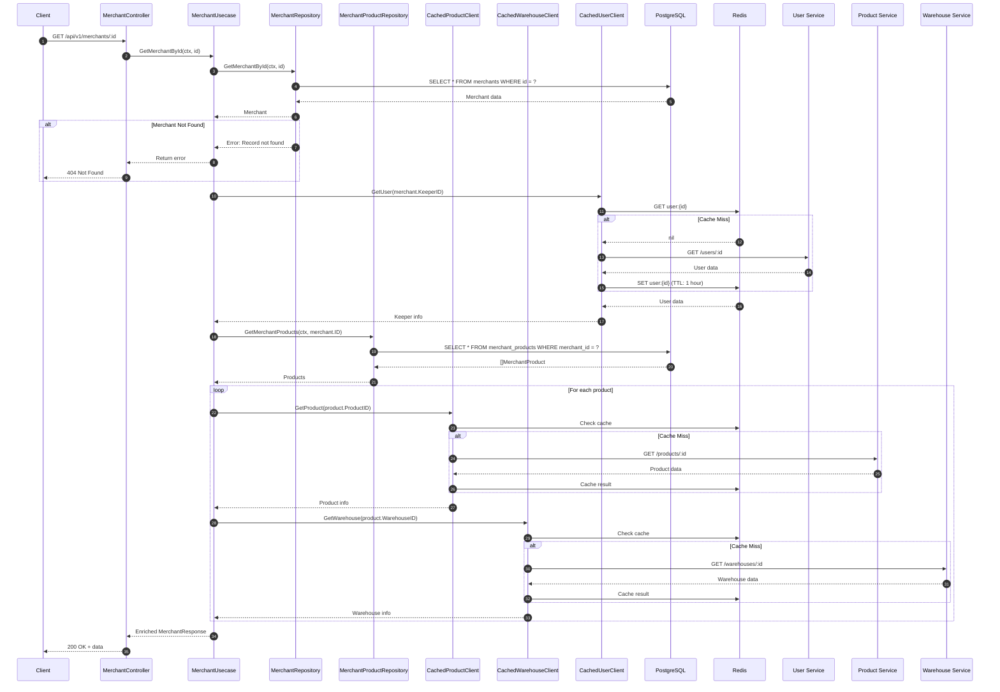

### 6.3 Stock Reduction via RabbitMQ

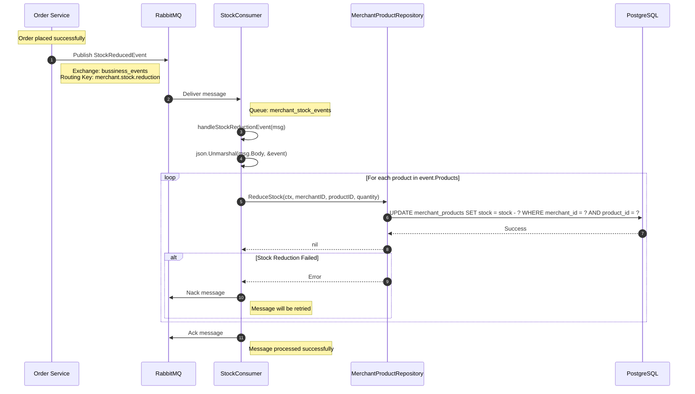

**Event Structure:**
```go
type StockReducedEvent struct {
    MerchantID uint                       `json:"merchant_id"`
    Products   []StockReducedEventProduct `json:"products"`
    OrderID    string                     `json:"order_id"`
    Timestamp  time.Time                  `json:"timestamp"`
}

type StockReducedEventProduct struct {
    ProductID uint `json:"product_id"`
    Quantity  int  `json:"quantity"`
}
```

### 6.4 Upload Merchant Photo

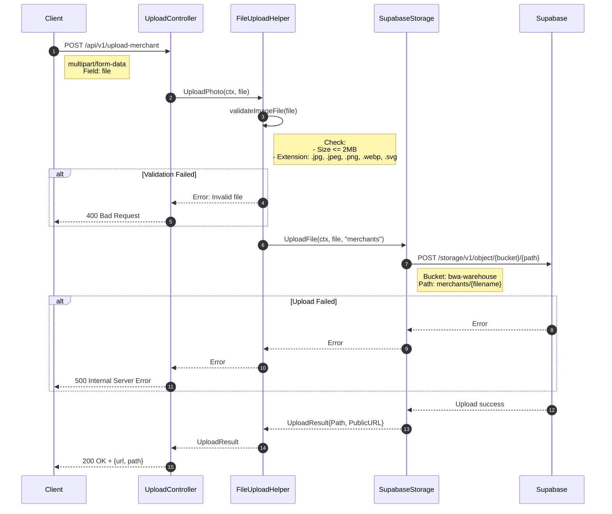

---

## 7. External Integrations Deep Dive

### 7.1 HTTP Clients Architecture

Implementasi **Decorator Pattern** untuk caching:

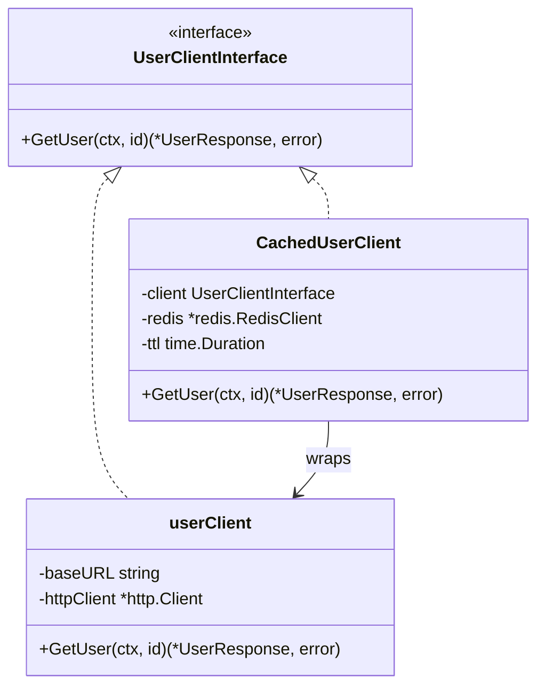

### 7.2 Client Detail

#### UserClient

```go
type UserResponse struct {
    ID        uint   `json:"id"`
    Name      string `json:"name"`
    Email     string `json:"email"`
    Phone     string `json:"phone"`
    CreatedAt string `json:"created_at"`
    UpdatedAt string `json:"updated_at"`
}

// Endpoint: GET {URL_USER_SERVICE}/api/v1/users/:id
```

#### ProductClient

```go
type ProductResponse struct {
    ID          uint             `json:"id"`
    Name        string           `json:"name"`
    About       string           `json:"about"`
    Price       float64          `json:"price"`
    Thumbnail   string           `json:"thumbnail"`
    Barcode     string           `json:"barcode"`
    Category    ProductCategory  `json:"category"`
}

// Endpoint: GET {URL_PRODUCT_SERVICE}/api/v1/products/:id
// Endpoint: GET {URL_PRODUCT_SERVICE}/api/v1/products/barcode/:barcode
```

#### WarehouseClient

```go
type WarehouseResponse struct {
    ID        uint   `json:"id"`
    Name      string `json:"name"`
    Address   string `json:"address"`
    Photo     string `json:"photo"`
    Phone     string `json:"phone"`
}

// Endpoint: GET {URL_WAREHOUSE_SERVICE}/api/v1/warehouses/:id
```

### 7.3 Caching Strategy

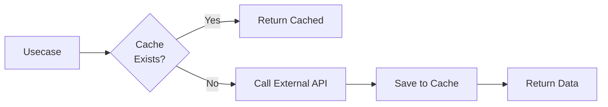

**Cache Configuration:**
- **TTL:** 1 hour (3600 seconds)
- **Key Format:** `{entity}:{id}` (contoh: `user:123`, `product:456`)
- **Strategy:** Cache-aside (lazy loading)

**Cached Client Implementation:**

```go
func (c *CachedUserClient) GetUser(ctx context.Context, id uint) (*UserResponse, error) {
    cacheKey := fmt.Sprintf("user:%d", id)
    
    // Try cache first
    var cached UserResponse
    if err := c.redis.Get(ctx, cacheKey, &cached); err == nil {
        return &cached, nil
    }
    
    // Cache miss - call real client
    user, err := c.client.GetUser(ctx, id)
    if err != nil {
        return nil, err
    }
    
    // Save to cache
    c.redis.Set(ctx, cacheKey, user, c.ttl)
    
    return user, nil
}
```

### 7.4 RabbitMQ Integration

#### Producer (rabbitmq_service.go)

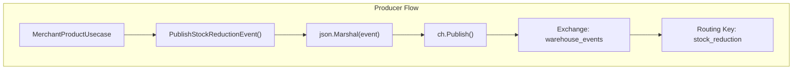

**Exchange & Queue Setup:**
```go
const (
    ExchangeName = "warehouse_events"  // Topic exchange
    QueueName    = "stock_reduction_queue"
    RoutingKey   = "stock_reduction"
)
```

#### Consumer (consumer.go)

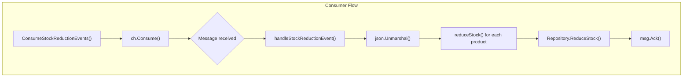

**Exchange & Queue Setup:**
```go
Exchange: "bussiness_events" (topic)
Queue: "merchant_stock_events"
Binding: routing_key = "merchant.stock.*"
```

### 7.5 Supabase Storage Integration

**Upload Flow:**

1. **Validate File:**
   - Size max: 2MB (`MaxImageSize = 2 * 1024 * 1024`)
   - Allowed extensions: `.jpg`, `.jpeg`, `.png`, `.webp`, `.svg`

2. **Upload ke Supabase:**
   - Endpoint: `POST {SUPABASE_URL}/object/{bucket}/{path}`
   - Bucket: `bwa-warehouse`
   - Path: `merchants/{filename}`

3. **Return:**
   - Path: lokasi file di storage
   - PublicURL: URL publik untuk akses file

---

## 8. Utility Packages (pkg/)

### 8.1 pkg/conv - Type Conversions

**File:** `pkg/conv/conv.go`

```go
// HashPassword - Generate bcrypt hash dari password
func HashPassword(password string) (string, error) {
    bytes, err := bcrypt.GenerateFromPassword([]byte(password), 14)
    return string(bytes), err
}

// CheckPasswordHash - Verifikasi password dengan hash
func CheckPasswordHash(password, hash string) bool {
    err := bcrypt.CompareHashAndPassword([]byte(hash), []byte(password))
    return err == nil
}

// StringToUint - Convert string ke uint
func StringToUint(s string) uint {
    id, err := strconv.ParseUint(s, 10, 64)
    if err != nil {
        return 0
    }
    return uint(id)
}
```

### 8.2 pkg/pagination - Pagination Utilities

**File:** `pkg/pagination/pagination.go`

```go
type PaginationResponse struct {
    CurrentPage  int   `json:"current_page"`
    TotalPages   int   `json:"total_pages"`
    TotalRecords int64 `json:"total_records"`
    Limit        int   `json:"limit"`
    HasNext      bool  `json:"has_next"`
    HasPrev      bool  `json:"has_prev"`
}

// CalculatePagination - Hitung metadata pagination
func CalculatePagination(page, limit, totalRecords int) PaginationResponse {
    totalPages := int(math.Ceil(float64(totalRecords) / float64(limit)))
    if totalPages == 0 {
        totalPages = 1
    }

    return PaginationResponse{
        CurrentPage:  page,
        TotalPages:   totalPages,
        TotalRecords: int64(totalRecords),
        Limit:        limit,
        HasNext:      page < totalPages,
        HasPrev:      page > 1,
    }
}
```

### 8.3 pkg/validator - Request Validation

**File:** `pkg/validator/request_validator.go`

```go
var validate *validator.Validate

func init() {
    validate = validator.New()
}

// Validate - Validasi struct dengan tag
func Validate(data interface{}) error {
    var errorMessages []string

    err := validate.Struct(data)
    if err != nil {
        for _, err := range err.(validator.ValidationErrors) {
            switch err.Tag() {
            case "required":
                errorMessages = append(errorMessages, 
                    fmt.Sprintf("%s is required", err.Field()))
            case "email":
                errorMessages = append(errorMessages, 
                    fmt.Sprintf("%s is not a valid email", err.Field()))
            case "min":
                errorMessages = append(errorMessages, 
                    fmt.Sprintf("%s must be at least %s characters", 
                        err.Field(), err.Param()))
            }
        }
        return errors.New("Validasi gagal: " + joinMessage(errorMessages))
    }
    return nil
}
```

### 8.4 pkg/redis - Redis Client Wrapper

**File:** `pkg/redis/redis_client.go`

```go
type RedisClient struct {
    client *redis.Client
}

// Methods:
func (rc *RedisClient) Ping(ctx context.Context) error
func (rc *RedisClient) Get(ctx context.Context, key string, value interface{}) error
func (rc *RedisClient) Set(ctx context.Context, key string, value interface{}, expiration time.Duration) error
func (rc *RedisClient) Delete(ctx context.Context, key string) error
func (rc *RedisClient) Exists(ctx context.Context, key string) (bool, error)
func (rc *RedisClient) TTL(ctx context.Context, key string) (time.Duration, error)
func (rc *RedisClient) Close(ctx context.Context) error
func (rc *RedisClient) FlushAll(ctx context.Context) error
```

**Key Features:**
- JSON marshaling/unmarshaling otomatis
- Error logging dengan format `[RedisClient] Method - Step: error`
- Connection pooling via go-redis

### 8.5 pkg/storage - File Upload Helper

**File:** `pkg/storage/file_upload_helper.go`

```go
const (
    MaxImageSize           = 2 * 1024 * 1024 // 2 MB
    AllowedImageExtensions = ".jpg,.jpeg,.png,.webp,.svg"
)

type FileUploadHelper struct {
    storage SupabaseInterface
    cfg     configs.Config
}

// UploadPhoto - Upload dengan validasi
func (h *FileUploadHelper) UploadPhoto(ctx context.Context, file *multipart.FileHeader) (*UploadResult, error)

// validateImageFile - Validasi size & extension
func (h *FileUploadHelper) validateImageFile(file *multipart.FileHeader, maxSize int64) error
```

---

## 9. Configuration & Environment

### 9.1 Complete .env Documentation

```env
# ============================================
# APPLICATION CONFIGURATION
# ============================================
APP_ENV=development              # environment: development, staging, production
APP_PORT=8084                    # HTTP server port

# ============================================
# DATABASE CONFIGURATION
# ============================================
DATABASE_HOST=localhost          # PostgreSQL host
DATABASE_PORT=5435               # PostgreSQL port
DATABASE_USER=postgres           # PostgreSQL user
DATABASE_PASSWORD=lokal          # PostgreSQL password
DATABASE_DB_NAME=warehouse_merchant_db  # Database name
DATABASE_DB_MAX_OPEN_CONNECTION=100     # Max open connections
DATABASE_DB_MAX_IDLE_CONNECTION=20      # Max idle connections

# ============================================
# RABBITMQ CONFIGURATION
# ============================================
RABBITMQ_HOST=localhost          # RabbitMQ host
RABBITMQ_PORT=5672               # RabbitMQ port
RABBITMQ_USER=guest              # RabbitMQ username
RABBITMQ_PASSWORD=guest          # RabbitMQ password

# ============================================
# REDIS CONFIGURATION
# ============================================
REDIS_HOST=localhost             # Redis host
REDIS_PORT=6379                  # Redis port

# ============================================
# SUPABASE STORAGE CONFIGURATION
# ============================================
SUPABASE_URL="https://xxxx.supabase.co/storage/v1"  # Supabase storage URL
SUPABASE_KEY="xxx"               # Supabase service key
SUPABASE_BUCKET="bwa-warehouse"  # Storage bucket name

# ============================================
# EXTERNAL SERVICES URL
# ============================================
URL_USER_SERVICE="http://localhost:8081"       # User Service endpoint
URL_PRODUCT_SERVICE="http://localhost:8082"    # Product Service endpoint
URL_WAREHOUSE_SERVICE="http://localhost:8083"  # Warehouse Service endpoint
```

### 9.2 Config Loading (configs/config.go)

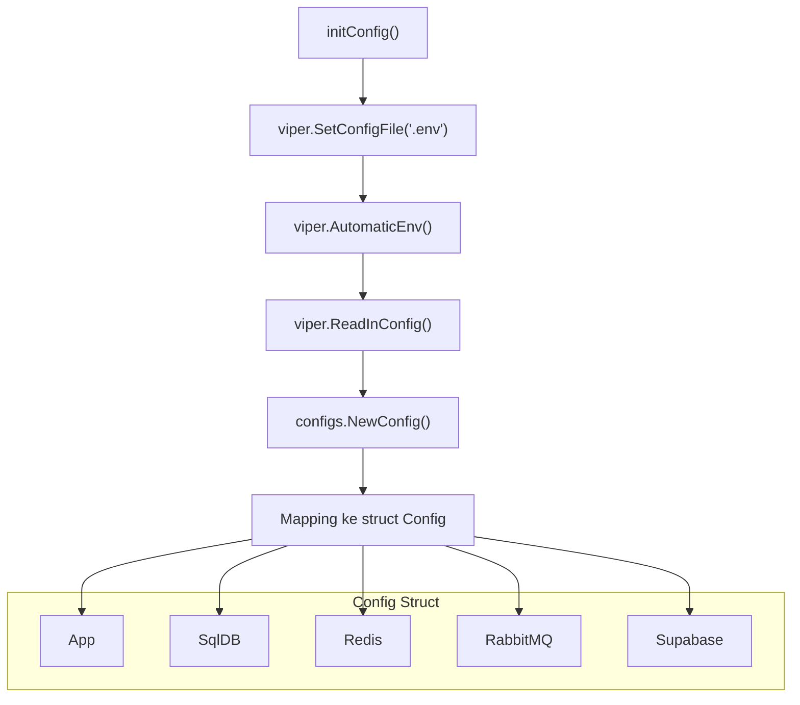

**Config Struct:**
```go
type Config struct {
    App      App      `json:"app"`
    SqlDB    SqlDB    `json:"sql_db"`
    Redis    Redis    `json:"redis"`
    RabbitMQ RabbitMQ `json:"rabbitmq"`
    Supabase Supabase `json:"supabase"`
}
```

**Helper Method:**
```go
func (r *RabbitMQ) URL() string {
    return fmt.Sprintf("amqp://%s:%s@%s:%s/", 
        r.Username, r.Password, r.Host, r.Port)
}
```

---

## 10. Development Patterns & Conventions

### 10.1 Naming Conventions

| Kategori | Format | Contoh |
|----------|--------|--------|
| **File** | `snake_case.go` | `merchant_controller.go` |
| **Interface** | `PascalCase` + `Interface` | `MerchantUsecaseInterface` |
| **Struct** | `PascalCase` | `MerchantController` |
| **Private struct** | `camelCase` | `merchantController` |
| **Method (exported)** | `PascalCase` | `CreateMerchant` |
| **Method (private)** | `camelCase` | `enrichMerchantData` |
| **Variable** | `camelCase` | `merchantRepo` |
| **Constant** | `PascalCase` atau `SCREAMING_SNAKE` | `MaxImageSize` |

### 10.2 Error Handling Patterns

#### Repository Layer - Context Cancellation Check

```go
select {
case <-ctx.Done():
    log.Errorf("[MerchantRepository] MethodName - 1: %v", ctx.Err())
    return ctx.Err()
default:
    // Continue with DB operation
}
```

#### Controller Layer - HTTP Error Response

```go
if err != nil {
    log.Errorf("[MerchantController] CreateMerchant - 3: %v", err)
    return c.Status(fiber.StatusInternalServerError).JSON(fiber.Map{
        "message": "Failed to create merchant",
    })
}
```

#### Usecase Layer - Error Propagation

```go
user, err := u.userClient.GetUser(ctx, keeperID)
if err != nil {
    log.Errorf("[MerchantUsecase] CreateMerchant - 2: %v", err)
    return response.MerchantResponse{}, err
}
```

### 10.3 Validation Patterns

**Struct Tags:**
```go
type CreateMerchantRequest struct {
    Name     string `json:"name" validate:"required"`
    KeeperID uint   `json:"keeper_id" validate:"required"`
    Address  string `json:"address" validate:"required"`
    Phone    string `json:"phone" validate:"required"`
    Photo    string `json:"photo" validate:"required"`
}

// Validasi dengan validator
decoded := &request.CreateMerchantRequest{}
if err := c.BodyParser(decoded); err != nil {
    return c.Status(fiber.StatusBadRequest).JSON(fiber.Map{
        "message": "Invalid request body",
    })
}

if err := validator.Validate(decoded); err != nil {
    return c.Status(fiber.StatusBadRequest).JSON(fiber.Map{
        "message": err.Error(),
    })
}
```

### 10.4 Caching Patterns

**Cache-Aside Pattern:**
```go
func (c *CachedUserClient) GetUser(ctx context.Context, id uint) (*UserResponse, error) {
    // 1. Check cache
    cacheKey := fmt.Sprintf("user:%d", id)
    var cached UserResponse
    if err := c.redis.Get(ctx, cacheKey, &cached); err == nil {
        return &cached, nil  // Cache hit
    }
    
    // 2. Cache miss - load from source
    user, err := c.client.GetUser(ctx, id)
    if err != nil {
        return nil, err
    }
    
    // 3. Update cache
    c.redis.Set(ctx, cacheKey, user, c.ttl)
    
    return user, nil
}
```

**Cache Key Naming:**
- Format: `{entity}:{id}`
- Contoh: `user:123`, `product:456`, `warehouse:789`

### 10.5 Logging Patterns

**Format:** `[PackageName] MethodName - StepNumber: message`

**Contoh:**
```go
log.Errorf("[MerchantRepository] GetMerchantById - 1: %v", ctx.Err())
log.Errorf("[MerchantController] CreateMerchant - 2: %v", err)
log.Infof("[StockConsumer] reduceStock: Successfully reduced stock")
```

**Step Number Convention:**
- Step 1: Context check atau inisialisasi
- Step 2: Validasi atau external call
- Step 3: Database operation
- Step N: Sesuai urutan operasi

---

## 11. API Reference

### 11.1 Merchant Endpoints

#### POST /api/v1/merchants
Create new merchant.

**Request:**
```json
{
  "name": "Toko Sejahtera",
  "keeper_id": 1,
  "address": "Jl. Sudirman No. 123, Jakarta",
  "phone": "081234567890",
  "photo": "https://cdn.example.com/merchant.jpg"
}
```

**Response 201:**
```json
{
  "id": 1,
  "name": "Toko Sejahtera",
  "keeper_id": 1,
  "address": "Jl. Sudirman No. 123, Jakarta",
  "phone": "081234567890",
  "photo": "https://cdn.example.com/merchant.jpg",
  "created_at": "2026-01-15T10:00:00Z"
}
```

#### GET /api/v1/merchants
List merchants dengan pagination.

**Query Parameters:**
| Parameter | Type | Default | Deskripsi |
|-----------|------|---------|-----------|
| page | int | 1 | Nomor halaman |
| limit | int | 10 | Jumlah item per halaman |
| search | string | "" | Search by name atau address |
| sort_by | string | "created_at" | Field sorting |
| sort_order | string | "desc" | "asc" atau "desc" |

**Response 200:**
```json
{
  "data": [...],
  "pagination": {
    "current_page": 1,
    "total_pages": 5,
    "total_records": 50,
    "limit": 10,
    "has_next": true,
    "has_prev": false
  }
}
```

#### GET /api/v1/merchants/:id
Get merchant by ID dengan products.

**Response 200:**
```json
{
  "id": 1,
  "name": "Toko Sejahtera",
  "keeper": {
    "id": 1,
    "name": "John Doe"
  },
  "products": [
    {
      "id": 1,
      "product_name": "Laptop ASUS",
      "stock": 10,
      "warehouse_name": "Warehouse A"
    }
  ]
}
```

#### PUT /api/v1/merchants/:id
Update merchant.

**Request:** Sama dengan POST, semua field opsional.

#### DELETE /api/v1/merchants/:id
Soft delete merchant.

**Response 200:**
```json
{
  "message": "Merchant deleted successfully"
}
```

### 11.2 Merchant Product Endpoints

#### POST /api/v1/merchant-products
Create merchant-product association.

**Request:**
```json
{
  "merchant_id": 1,
  "product_id": 5,
  "warehouse_id": 2,
  "stock": 100
}
```

#### GET /api/v1/merchant-products
List all merchant products.

#### GET /api/v1/merchant-products/:id
Get by ID.

#### GET /api/v1/merchant-products/barcode/:barcode
Get by product barcode.

#### PUT /api/v1/merchant-products/:id
Update stock.

**Request:**
```json
{
  "stock": 150
}
```

#### DELETE /api/v1/merchant-products/:id
Delete single association.

#### DELETE /api/v1/merchant-products/product/:product_id
Delete all associations for a product.

#### GET /api/v1/merchant-products/:product_id/total-stock
Get total stock across all merchants.

**Response 200:**
```json
{
  "product_id": 5,
  "total_stock": 250
}
```

### 11.3 Upload Endpoints

#### POST /api/v1/upload-merchant
Upload merchant photo.

**Request:** `multipart/form-data`
- Field: `file` (image file)

**Response 200:**
```json
{
  "url": "https://cdn.supabase.com/bwa-warehouse/merchants/photo_123.jpg",
  "path": "merchants/photo_123.jpg"
}
```

---

## 12. Database Schema

### 12.1 Entity Relationship Diagram

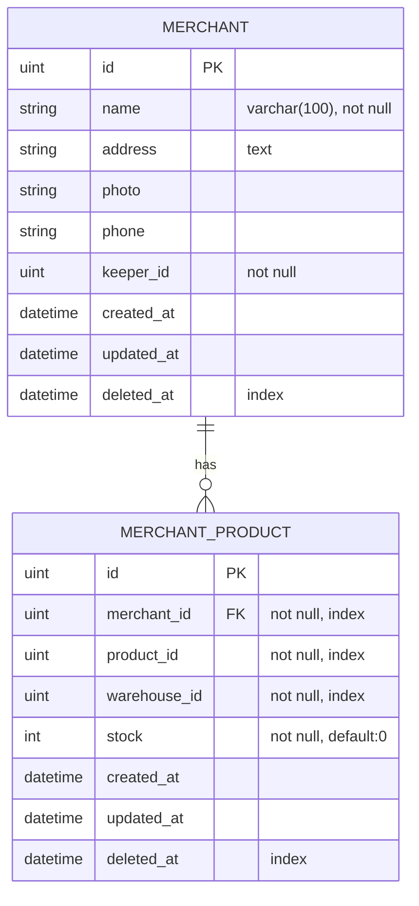

### 12.2 Index Analysis

| Tabel | Index | Kolom | Tujuan |
|-------|-------|-------|--------|
| merchants | PRIMARY | id | Primary key lookup |
| merchants | idx_merchants_deleted_at | deleted_at | Soft delete queries |
| merchant_products | PRIMARY | id | Primary key lookup |
| merchant_products | idx_merchant_products_merchant_id | merchant_id | Query by merchant |
| merchant_products | idx_merchant_products_product_id | product_id | Query by product |
| merchant_products | idx_merchant_products_warehouse_id | warehouse_id | Query by warehouse |
| merchant_products | idx_merchant_products_deleted_at | deleted_at | Soft delete queries |

### 12.3 GORM Migration

```go
// Auto-migration di database/postgres_database.go
db.AutoMigrate(&model.Merchant{}, &model.MerchantProduct{})
```

**Schema yang di-generate GORM:**

```sql
-- Table: merchants
CREATE TABLE merchants (
    id SERIAL PRIMARY KEY,
    name VARCHAR(100) NOT NULL,
    address TEXT,
    photo VARCHAR(255),
    phone VARCHAR(20),
    keeper_id INTEGER NOT NULL,
    created_at TIMESTAMP WITH TIME ZONE,
    updated_at TIMESTAMP WITH TIME ZONE,
    deleted_at TIMESTAMP WITH TIME ZONE
);

CREATE INDEX idx_merchants_deleted_at ON merchants(deleted_at);

-- Table: merchant_products
CREATE TABLE merchant_products (
    id SERIAL PRIMARY KEY,
    merchant_id INTEGER NOT NULL,
    product_id INTEGER NOT NULL,
    warehouse_id INTEGER NOT NULL,
    stock INTEGER NOT NULL DEFAULT 0,
    created_at TIMESTAMP WITH TIME ZONE,
    updated_at TIMESTAMP WITH TIME ZONE,
    deleted_at TIMESTAMP WITH TIME ZONE
);

CREATE INDEX idx_merchant_products_merchant_id ON merchant_products(merchant_id);
CREATE INDEX idx_merchant_products_product_id ON merchant_products(product_id);
CREATE INDEX idx_merchant_products_warehouse_id ON merchant_products(warehouse_id);
CREATE INDEX idx_merchant_products_deleted_at ON merchant_products(deleted_at);
```

### 12.4 Connection Pooling

```go
sqlDB, err := db.DB()
if err != nil {
    return nil, err
}

// Set connection pool
sqlDB.SetMaxIdleConns(cfg.SqlDB.DBMaxIdleConns)      // Default: 20
sqlDB.SetMaxOpenConns(cfg.SqlDB.DBMaxOpenConns)      // Default: 100
```

**Penjelasan:**
- **MaxIdleConns:** Jumlah koneksi idle yang dipertahankan dalam pool
- **MaxOpenConns:** Jumlah maksimum koneksi terbuka ke database

---

## 13. Testing Strategy

### 13.1 Unit Testing Approach

**Repository Tests:**
- Gunakan `sqlmock` untuk mock database
- Atau gunakan testcontainers untuk integration test dengan PostgreSQL

```go
// Contoh struktur test
func TestMerchantRepository_CreateMerchant(t *testing.T) {
    // Setup mock DB
    // Call repository method
    // Assert expectation
}
```

**Usecase Tests:**
- Mock repositories menggunakan interfaces
- Mock external clients

```go
func TestMerchantUsecase_CreateMerchant(t *testing.T) {
    // Setup mock repository
    // Setup mock user client
    // Call usecase method
    // Assert result
}
```

**Controller Tests:**
- Gunakan Fiber test utilities
- Mock usecases

```go
func TestMerchantController_CreateMerchant(t *testing.T) {
    // Setup Fiber app
    // Setup mock usecase
    // Create request
    // Assert response
}
```

### 13.2 Integration Testing

**External Service Mocking:**
- Gunakan `httptest` server untuk mock User/Product/Warehouse services
- Verifikasi cache behavior

**RabbitMQ Testing:**
- Gunakan RabbitMQ test container
- Verifikasi message publish/consume

**Database Testing:**
- Gunakan PostgreSQL test container
- Verifikasi migration dan query

---

## 14. Troubleshooting & FAQ

### 14.1 Common Issues

#### Port already in use

**Error:**
```
bind: address already in use
```

**Solution:**
```bash
# Find and kill process
lsof -ti:8084 | xargs kill -9

# Atau gunakan port lain
APP_PORT=8085 go run main.go
```

#### Database connection failed

**Error:**
```
failed to connect to database: dial error...
```

**Checklist:**
1. ✅ PostgreSQL running on port 5435
2. ✅ Database `warehouse_merchant_db` sudah dibuat
3. ✅ Credentials benar di `.env`
4. ✅ Firewall tidak memblokir

#### Redis connection failed

**Error:**
```
EOF atau connection refused
```

**Solution:**
```bash
# Check Redis status
redis-cli ping

# Start Redis
redis-server
```

#### RabbitMQ connection failed

**Error:**
```
dial tcp: connect: connection refused
```

**Checklist:**
1. ✅ RabbitMQ running on port 5672
2. ✅ Credentials benar (default: guest/guest)
3. ✅ Management UI bisa diakses: http://localhost:15672

### 14.2 Debugging Guide

**Enable Debug Logging:**
```go
// Di app.go, tambahkan:
app.Use(logger.New(logger.Config{
    Format: "[${time}] ${status} - ${method} ${path} ${latency}\n",
}))
```

**Trace Request Flow:**
1. Check log format: `[Package] Method - Step: message`
2. Ikuti step number untuk trace flow
3. Cek context cancellation di repository layer

**Check External Service Health:**
```bash
# User Service
curl http://localhost:8081/health

# Product Service
curl http://localhost:8082/health

# Warehouse Service
curl http://localhost:8083/health
```

### 14.3 Performance Optimization

**Cache Hit/Miss Analysis:**
```bash
# Monitor Redis
redis-cli monitor | grep "user:\|product:\|warehouse:"
```

**Database Query Optimization:**
1. Pastikan indexes sudah dibuat (cek bagian 12.2)
2. Gunakan EXPLAIN ANALYZE untuk slow queries
3. Review N+1 query problem

**Connection Pool Tuning:**
- Monitor active connections: `SELECT count(*) FROM pg_stat_activity;`
- Adjust `DBMaxOpenConns` dan `DBMaxIdleConns` berdasarkan load

---

## 15. Deployment Guide

### 15.1 Docker Build

**Dockerfile:**
```dockerfile
# Build stage
FROM golang:1.24-alpine AS builder

WORKDIR /app

# Copy go mod files
COPY go.mod go.sum ./
RUN go mod download

# Copy source code
COPY . .

# Build binary
RUN CGO_ENABLED=0 GOOS=linux go build -o merchant-service main.go

# Runtime stage
FROM alpine:latest

RUN apk --no-cache add ca-certificates

WORKDIR /root/

# Copy binary dari builder
COPY --from=builder /app/merchant-service .

# Expose port
EXPOSE 8084

# Run
CMD ["./merchant-service", "start"]
```

**Build & Run:**
```bash
# Build image
docker build -t merchant-service:latest .

# Run container
docker run -p 8084:8084 \
  --env-file .env \
  merchant-service:latest
```

### 15.2 Production Checklist

**Environment Variables:**
- [ ] `APP_ENV=production`
- [ ] Database credentials menggunakan secret management
- [ ] `SUPABASE_KEY` rotated dan secure
- [ ] External service URLs pointing ke production endpoints

**Health Checks:**
- [ ] Endpoint `/health` tersedia
- [ ] Liveness probe configured
- [ ] Readiness probe configured

**Monitoring:**
- [ ] Log aggregation (ELK/Loki)
- [ ] Metrics collection (Prometheus)
- [ ] Distributed tracing (Jaeger/Zipkin)

**Security:**
- [ ] CORS configured untuk production domains
- [ ] Rate limiting enabled
- [ ] TLS/SSL enabled

---

## 📚 Appendix

### A. Quick Command Reference

```bash
# Install dependencies
go mod download

# Run development
go run main.go

# Run dengan custom config
go run main.go --config /path/to/.env

# Build binary
go build -o merchant-service main.go

# Run binary
./merchant-service start

# Test (ketika sudah ada test)
go test ./...

# Docker build
docker build -t merchant-service:latest .
```

### B. Related Services

| Service | Port | Repository |
|---------|------|------------|
| User Service | 8081 | user-service |
| Product Service | 8082 | product-service |
| Warehouse Service | 8083 | warehouse-service |
| **Merchant Service** | **8084** | **This service** |

### C. Learning Path untuk Tim Baru

**⏱️ 30 Menit - Overview:**
1. Baca Executive Summary (Bagian 1)
2. Pahami Architecture Overview (Bagian 2)
3. Pelajari Project Structure (Bagian 3)

**⏱️ 1 Jam - Setup & Running:**
1. Install prerequisites
2. Setup environment variables
3. Jalankan service
4. Test endpoints dengan Postman/curl

**⏱️ 2 Jam - Deep Dive:**
1. Pelajari Layer-by-Layer (Bagian 5)
2. Pahami Data Flow (Bagian 6)
3. Pelajari External Integrations (Bagian 7)

**⏱️ 3 Jam - Hands-on:**
1. Buat endpoint baru (mengikuti pattern existing)
2. Implementasi test
3. Code review dengan senior engineer

---

**End of Documentation**

> "The only way to learn a new programming language is by writing programs in it." — Dennis Ritchie
