# 📘 Product Service - Developer Guide

> **Version**: 1.0  
> **Target Audience**: Junior Engineers (New to Go & Microservices)  
> **Reading Time**: ~60 minutes  
> **Last Updated**: 2026-02-14

---

## 📋 Table of Contents

1. [Overview](#1-overview)
2. [System Architecture](#2-system-architecture)
3. [Project Structure](#3-project-structure)
4. [Request Lifecycle](#4-request-lifecycle)
5. [Layer-by-Layer Deep Dive](#5-layer-by-layer-deep-dive)
6. [Database Schema](#6-database-schema)
7. [External Integrations](#7-external-integrations)
8. [Common Patterns](#8-common-patterns)
9. [Adding New Features](#9-adding-new-features)
10. [Troubleshooting](#10-troubleshooting)

---

## 1. Overview

### 1.1 What is Product Service?

Product Service is a **microservice** responsible for managing product and category data in the micro-warehouse ecosystem. It serves as the central source of truth for product information.

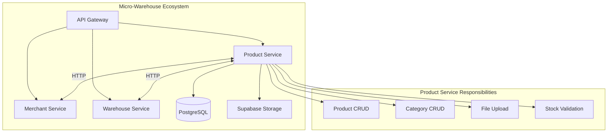

### 1.2 Tech Stack

| Component | Technology | Purpose |
|-----------|------------|---------|
| Language | Go 1.24.7 | Programming language |
| Framework | Fiber v2 | HTTP web framework |
| ORM | GORM | Database operations |
| Database | PostgreSQL | Primary data store |
| Validation | go-playground/validator | Request validation |
| Config | Viper | Configuration management |
| CLI | Cobra | Command-line interface |
| Logging | Zerolog | Structured logging |
| Storage | Supabase | File storage |

### 1.3 Quick Start

```bash
# 1. Clone and navigate
cd product-service

# 2. Install dependencies
go mod download

# 3. Setup database (PostgreSQL)
# Create database: warehouse_product_db

# 4. Configure environment
cp .env.example .env
# Edit .env with your credentials

# 5. Run the service
go run main.go start

# Service will be available at http://localhost:8082
```

---

## 2. System Architecture

### 2.1 Layered Architecture

Product Service follows **Clean Architecture / Layered Architecture** with 3 main layers:

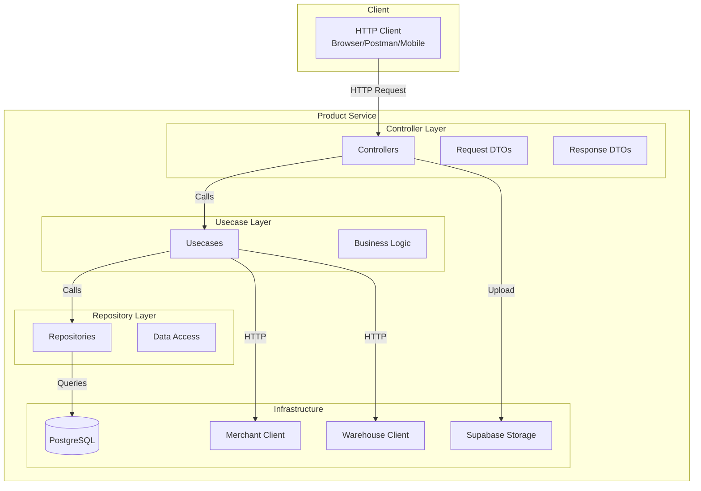

### 2.2 Dependency Flow

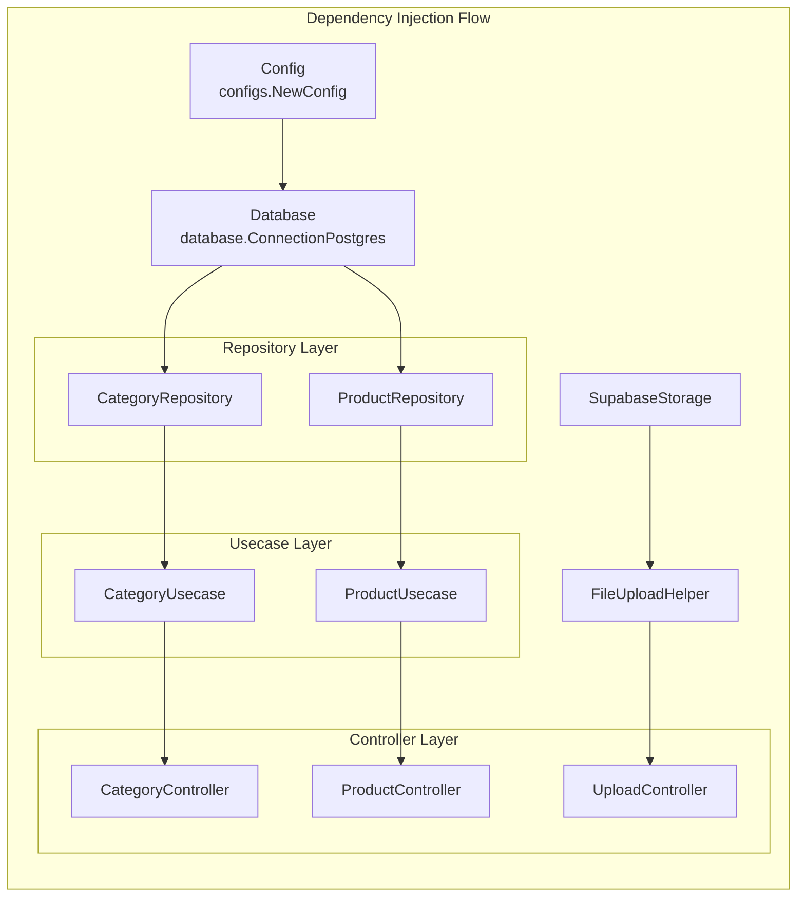

### 2.3 Interface-Based Design

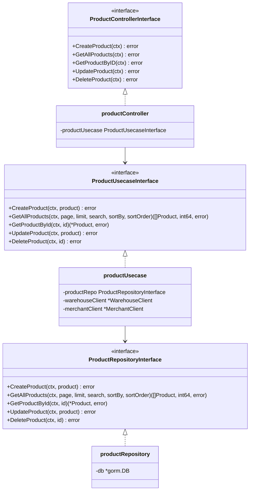

---

## 3. Project Structure

### 3.1 Directory Tree

```
product-service/
│
├── main.go                          # Application entry point
├── go.mod                           # Go module definition
├── go.sum                           # Dependency checksums
├── .env                             # Environment variables
│
├── cmd/                             # CLI Commands (Cobra)
│   ├── root.go                      # Root command & config init
│   └── start.go                     # Start server command
│
├── configs/                         # Configuration management
│   └── config.go                    # Config structs & loader
│
├── app/                             # Application bootstrap
│   ├── app.go                       # Server setup & middleware
│   ├── container.go                 # Dependency injection
│   └── routes.go                    # HTTP route definitions
│
├── controller/                      # HTTP Handlers (Layer 1)
│   ├── product_controller.go        # Product endpoints handler
│   ├── category_controller.go       # Category endpoints handler
│   ├── upload_controller.go         # File upload handler
│   ├── request/                     # Request DTOs
│   │   ├── product_request.go
│   │   └── category_request.go
│   └── response/                    # Response DTOs
│       ├── product_response.go
│       ├── category_response.go
│       └── upload_response.go
│
├── usecase/                         # Business Logic (Layer 2)
│   ├── product_usecase.go           # Product business rules
│   └── category_usecase.go          # Category business rules
│
├── repository/                      # Data Access (Layer 3)
│   ├── product_repository.go        # Product DB operations
│   └── category_repository.go       # Category DB operations
│
├── model/                           # Domain Models
│   ├── product_model.go             # Product entity (GORM)
│   └── category_model.go            # Category entity (GORM)
│
├── database/                        # Database Connection
│   └── postgres_database.go         # PostgreSQL connection
│
└── pkg/                             # Shared Utilities
    ├── conv/conv.go                 # Type conversions
    ├── pagination/pagination.go     # Pagination calculation
    ├── validator/                   # Request validation
    │   └── request_validator.go
    ├── storage/                     # File storage
    │   ├── supabase_storage.go
    │   └── file_upload_helper.go
    └── httpclient/                  # External HTTP clients
        ├── merchant_client.go
        └── warehouse_client.go
```

### 3.2 File Purposes

| File | Purpose | Layer |
|------|---------|-------|
| `main.go` | Entry point, delegates to cmd | - |
| `cmd/*.go` | CLI command definitions | - |
| `configs/config.go` | Load and structure environment variables | - |
| `app/app.go` | Server initialization, middleware, graceful shutdown | Bootstrap |
| `app/container.go` | Wire all dependencies (DI container) | Bootstrap |
| `app/routes.go` | Define HTTP routes and handlers | Bootstrap |
| `controller/*_controller.go` | Handle HTTP requests/responses | Controller |
| `controller/request/*.go` | Define and validate request structures | Controller |
| `controller/response/*.go` | Define response structures | Controller |
| `usecase/*_usecase.go` | Business logic and rules | Usecase |
| `repository/*_repository.go` | Database CRUD operations | Repository |
| `model/*_model.go` | Database entity definitions | Model |
| `database/postgres_database.go` | Database connection and migration | Infrastructure |
| `pkg/*` | Reusable utilities | Shared |

---

## 4. Request Lifecycle

### 4.1 Standard Request Flow

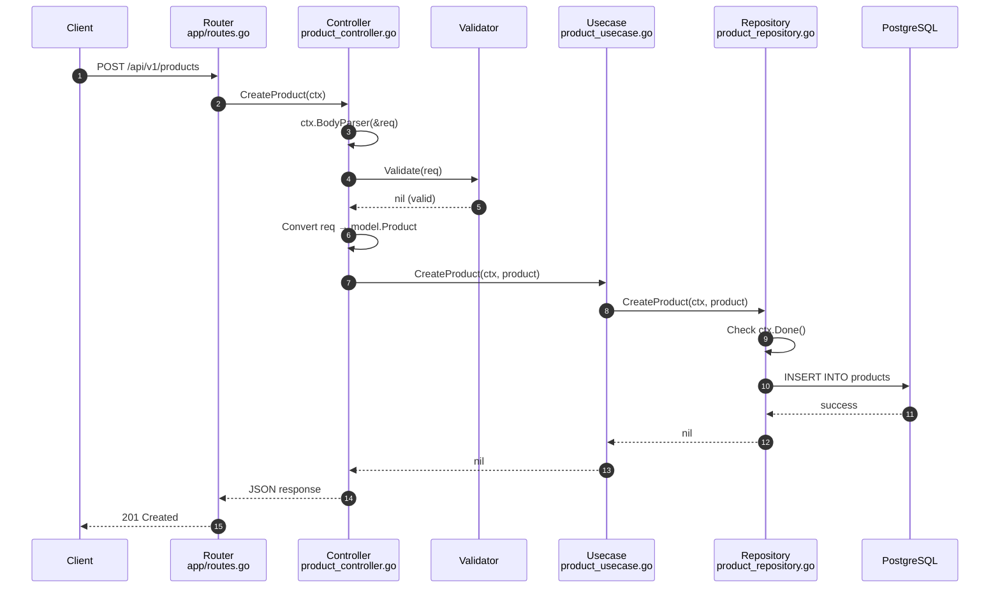

### 4.2 Delete Product Flow (With External Validation)

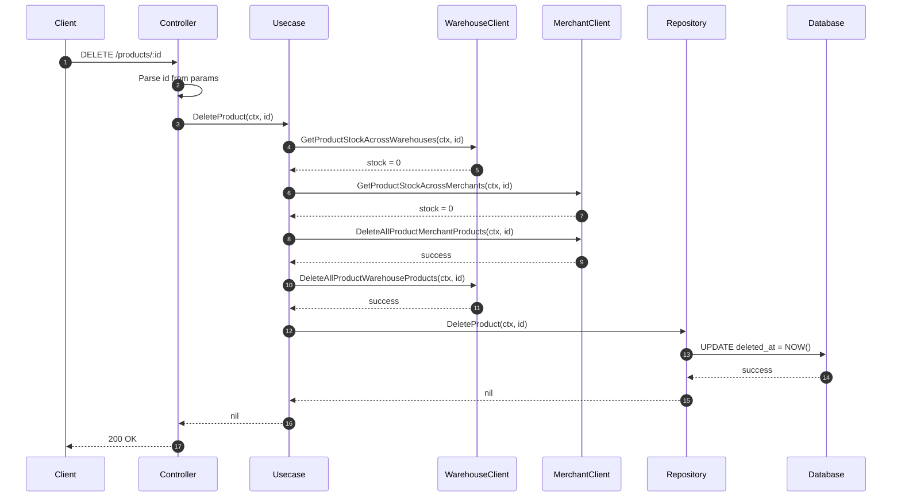

### 4.3 File Upload Flow

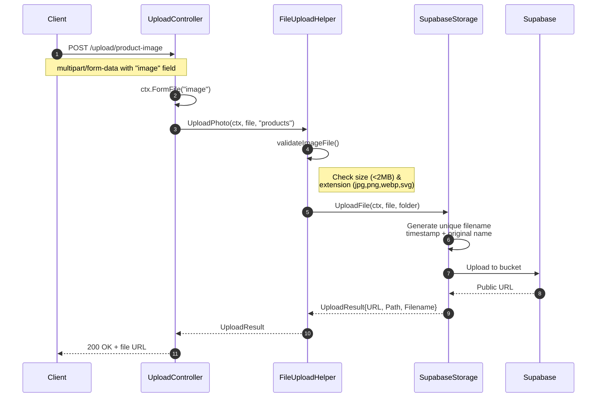

---

## 5. Layer-by-Layer Deep Dive

### 5.1 Entry Point (`main.go`)

```go
package main

import "micro-warehouse/product-service/cmd"

func main() {
    cmd.Execute()
}
```

**Explanation**: The `main.go` is intentionally minimal. It delegates to the `cmd` package following the Cobra CLI pattern.

### 5.2 CLI Layer (`cmd/`)

#### `cmd/root.go` - Root Command

```go
var rootCmd = &cobra.Command{
    Use:   "product-service",
    Short: "Product Service CLI",
    Run: func(cmd *cobra.Command, args []string) {
        cmd.Run(startCmd, nil)  // Default: run start command
    },
}

func init() {
    cobra.OnInitialize(initConfig)
    rootCmd.PersistentFlags().StringVar(&cfgFile, "config", "", "config file")
}

func initConfig() {
    if cfgFile != "" {
        viper.SetConfigFile(cfgFile)
    } else {
        viper.SetConfigFile(`.env`)
    }
    viper.AutomaticEnv()
    viper.ReadInConfig()
}
```

**Key Points**:
- `init()` runs automatically when package is imported
- `viper` handles configuration loading from `.env` or custom files
- `cobra` provides CLI framework

#### `cmd/start.go` - Start Command

```go
var startCmd = &cobra.Command{
    Use:   "start",
    Short: "Start the HTTP server",
    Run: func(cmd *cobra.Command, args []string) {
        app.RunServer()
    },
}

func init() {
    rootCmd.AddCommand(startCmd)
}
```

**Usage**:
```bash
go run main.go start              # Start server
go run main.go --config=prod.env start  # With custom config
```

### 5.3 Configuration (`configs/config.go`)

```go
// Config structs group related settings
type Config struct {
    App      App
    SqlDB    SqlDB
    Supabase Supabase
}

type App struct {
    AppPort             string
    UrlMerchantService  string
    UrlWarehouseService string
}

// Constructor loads from environment
func NewConfig() *Config {
    return &Config{
        App: App{
            AppPort: viper.GetString("APP_PORT"),
            UrlMerchantService: viper.GetString("URL_MERCHANT_SERVICE"),
        },
        // ...
    }
}
```

**Flow**:
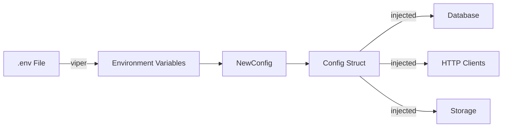

### 5.4 Application Bootstrap (`app/`)

#### `app/app.go` - Server Setup

```go
func RunServer() {
    cfg := configs.NewConfig()
    
    // Create Fiber app with custom error handler
    app := fiber.New(fiber.Config{
        ErrorHandler: func(c *fiber.Ctx, err error) error {
            return c.Status(500).SendString("Internal Server Error")
        },
    })
    
    // Middleware (runs on every request)
    app.Use(recover.New())  // Catch panics
    app.Use(cors.New())     // Enable CORS
    app.Use(logger.New())   // Log requests
    
    // Build dependencies and routes
    container := BuildContainer()
    SetupRoutes(app, container)
    
    // Start server in goroutine
    go func() {
        app.Listen(":" + cfg.App.AppPort)
    }()
    
    // Graceful shutdown
    quit := make(chan os.Signal, 1)
    signal.Notify(quit, os.Interrupt, syscall.SIGTERM)
    <-quit
    
    app.ShutdownWithContext(ctx)
}
```

#### `app/container.go` - Dependency Injection

```go
type Container struct {
    ProductController  controller.ProductControllerInterface
    CategoryController controller.CategoryControllerInterface
    UploadController   controller.UploadControllerInterface
}

func BuildContainer() *Container {
    config := configs.NewConfig()
    db, _ := database.ConnectionPostgres(*config)
    
    // Category chain
    categoryRepo := repository.NewCategoryRepository(db.DB)
    categoryUseCase := usecase.NewCategoryUsecase(categoryRepo)
    categoryController := controller.NewCategoryController(categoryUseCase)
    
    // Product chain
    productRepo := repository.NewProductRepository(db.DB)
    productUseCase := usecase.NewProductUsecase(productRepo)
    productController := controller.NewProductController(productUseCase)
    
    // Upload chain
    supabaseStorage := storage.NewSupabaseStorage(*config)
    fileUploadHelper := storage.NewFileUploadHelper(supabaseStorage, *config)
    uploadController := controller.NewUploadController(fileUploadHelper)
    
    return &Container{
        ProductController:  productController,
        CategoryController: categoryController,
        UploadController:   uploadController,
    }
}
```

**Dependency Chain**:
```
Database → Repository → Usecase → Controller
```

#### `app/routes.go` - Route Definitions

```go
func SetupRoutes(app *fiber.App, container *Container) {
    api := app.Group("/api/v1")
    
    // Categories
    categories := api.Group("/categories")
    categories.Post("/", container.CategoryController.CreateCategory)
    categories.Get("/", container.CategoryController.GetAllCategories)
    categories.Get("/:id", container.CategoryController.GetCategoryByID)
    categories.Put("/:id", container.CategoryController.UpdateCategory)
    categories.Delete("/:id", container.CategoryController.DeleteCategory)
    
    // Products
    products := api.Group("/products")
    products.Post("/", container.ProductController.CreateProduct)
    products.Get("/", container.ProductController.GetAllProducts)
    products.Get("/:id", container.ProductController.GetProductByID)
    products.Get("/barcode/:barcode", container.ProductController.GetProductByBarcode)
    products.Put("/:id", container.ProductController.UpdateProduct)
    products.Delete("/:id", container.ProductController.DeleteProduct)
    
    // Uploads
    uploads := api.Group("/upload")
    uploads.Post("/product-image", container.UploadController.UploadProductImage)
    uploads.Post("/category-image", container.UploadController.UploadCategoryImage)
}
```

### 5.5 Controller Layer

Controllers handle HTTP concerns: parsing input, validation, calling usecase, formatting response.

#### Pattern

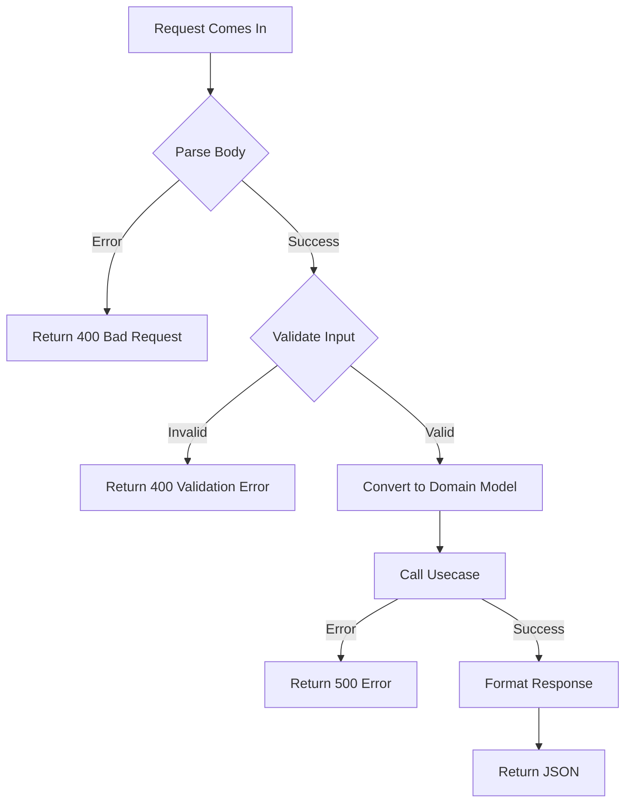

#### Example: `controller/product_controller.go`

```go
type ProductControllerInterface interface {
    CreateProduct(ctx *fiber.Ctx) error
    GetAllProducts(ctx *fiber.Ctx) error
    // ...
}

type productController struct {
    productUsecase usecase.ProductUsecaseInterface
}

func (p *productController) CreateProduct(ctx *fiber.Ctx) error {
    // 1. Parse request
    var req request.CreateProductRequest
    if err := ctx.BodyParser(&req); err != nil {
        log.Errorf("[ProductController] CreateProduct - 1: %v", err)
        return ctx.Status(400).JSON(fiber.Map{"message": "Invalid request body"})
    }
    
    // 2. Validate
    if err := validator.Validate(req); err != nil {
        log.Errorf("[ProductController] CreateProduct - 2: %v", err)
        return ctx.Status(400).JSON(fiber.Map{"message": err.Error()})
    }
    
    // 3. Convert to model
    reqModel := model.Product{
        Name: req.Name,
        Barcode: req.Barcode,
        // ...
    }
    
    // 4. Call usecase
    if err := p.productUsecase.CreateProduct(ctx.Context(), &reqModel); err != nil {
        log.Errorf("[ProductController] CreateProduct - 3: %v", err)
        return ctx.Status(500).JSON(fiber.Map{"message": "Failed to create product"})
    }
    
    // 5. Return success
    return ctx.Status(201).JSON(fiber.Map{
        "message": "Product created successfully",
    })
}
```

#### Request DTOs (`controller/request/`)

```go
type CreateProductRequest struct {
    Name       string  `json:"name" validate:"required"`
    Barcode    string  `json:"barcode" validate:"required"`
    Price      float64 `json:"price" validate:"required"`
    CategoryID uint    `json:"category_id" validate:"required"`
    Thumbnail  string  `json:"thumbnail" validate:"required"`
    IsPopular  bool    `json:"is_popular"`
}

type GetAllProductRequest struct {
    Page      int    `query:"page"`
    Limit     int    `query:"limit"`
    Search    string `query:"search"`
    SortBy    string `query:"sort_by"`
    SortOrder string `query:"sort_order"`
}
```

**Struct Tags**:
- `json:"name"` - Maps JSON field to struct field
- `validate:"required"` - Validation rule (must be provided)
- `query:"page"` - Maps query parameter to struct field

#### Response DTOs (`controller/response/`)

```go
type ProductResponse struct {
    ID         uint             `json:"id"`
    Name       string           `json:"name"`
    Barcode    string           `json:"barcode"`
    Price      int              `json:"price"`
    Category   CategoryResponse `json:"category"`
}

type GetAllProductResponse struct {
    Products   []ProductResponse
    Pagination pagination.PaginationResponse
}
```

### 5.6 Usecase Layer

Usecases contain business logic and orchestrate operations.

#### Simple Usecase: `usecase/category_usecase.go`

```go
type CategoryUsecaseInterface interface {
    CreateCategory(ctx context.Context, category *model.Category) error
    GetAllCategories(ctx context.Context, page, limit int, search, sortBy, sortOrder string) ([]model.Category, int64, error)
    GetCategoryByID(ctx context.Context, id uint) (*model.Category, error)
    UpdateCategory(ctx context.Context, category *model.Category) error
    DeleteCategory(ctx context.Context, id uint) error
}

type categoryUsecase struct {
    categoryRepo repository.CategoryRepositoryInterface
}

// Simple pass-through for Create
func (c *categoryUsecase) CreateCategory(ctx context.Context, category *model.Category) error {
    return c.categoryRepo.CreateCategory(ctx, category)
}
```

#### Complex Usecase: `usecase/product_usecase.go` (Delete)

```go
type productUsecase struct {
    productRepo     repository.ProductRepositoryInterface
    warehouseClient *httpclient.WarehouseClient
    merchantClient  *httpclient.MerchantClient
}

func (p *productUsecase) DeleteProduct(ctx context.Context, id uint) error {
    // Business Rule: Check warehouse stock
    warehouseStock, err := p.warehouseClient.GetProductStockAcrossWarehouses(ctx, id)
    if err != nil {
        return err
    }
    if warehouseStock > 0 {
        return errors.New("product has stock in warehouse")
    }
    
    // Business Rule: Check merchant stock
    merchantStock, err := p.merchantClient.GetProductStockAcrossMerchants(ctx, id)
    if err != nil {
        return err
    }
    if merchantStock > 0 {
        return errors.New("product has stock in merchant")
    }
    
    // Cleanup references
    p.merchantClient.DeleteAllProductMerchantProducts(ctx, id)
    p.warehouseClient.DeleteAllProductWarehouseProducts(ctx, id)
    
    // Finally delete
    return p.productRepo.DeleteProduct(ctx, id)
}
```

### 5.7 Repository Layer

Repositories handle all database operations using GORM.

#### Pattern

```go
// 1. Define Interface
type ProductRepositoryInterface interface {
    CreateProduct(ctx context.Context, product *model.Product) error
    GetAllProducts(ctx context.Context, page, limit int, search, sortBy, sortOrder string) ([]model.Product, int64, error)
    GetProductById(ctx context.Context, id uint) (*model.Product, error)
    UpdateProduct(ctx context.Context, product *model.Product) error
    DeleteProduct(ctx context.Context, id uint) error
}

// 2. Define Implementation
type productRepository struct {
    db *gorm.DB
}

// 3. Constructor
func NewProductRepository(db *gorm.DB) ProductRepositoryInterface {
    return &productRepository{db: db}
}
```

#### Context Cancellation Pattern (CRITICAL)

Every repository method MUST check context cancellation:

```go
func (p *productRepository) CreateProduct(ctx context.Context, product *model.Product) error {
    select {
    case <-ctx.Done():
        // Context cancelled/timeout - don't proceed
        log.Errorf("[ProductRepository] CreateProduct - 1: %v", ctx.Err())
        return ctx.Err()
    default:
        // Context OK - proceed with DB operation
        return p.db.WithContext(ctx).Create(product).Error
    }
}
```

#### Pagination Pattern

```go
func (p *productRepository) GetAllProducts(ctx context.Context, page, limit int, search, sortBy, sortOrder string) ([]model.Product, int64, error) {
    // Set defaults
    if page <= 0 { page = 1 }
    if limit <= 0 { limit = 10 }
    if sortBy == "" { sortBy = "created_at" }
    if sortOrder == "" { sortOrder = "desc" }
    
    // Calculate offset
    offset := (page - 1) * limit
    
    // Build query
    query := p.db.Model(&model.Product{})
    if search != "" {
        query = query.Where("name ILIKE ?", "%"+search+"%")
    }
    
    // Count total
    var total int64
    query.Count(&total)
    
    // Execute with pagination
    var products []model.Product
    err := query.
        Order(sortBy + " " + sortOrder).
        Preload("Category").
        Offset(offset).
        Limit(limit).
        Find(&products).Error
    
    return products, total, err
}
```

### 5.8 Model Layer (`model/`)

#### `model/product_model.go`

```go
type Product struct {
    // Primary Key
    ID         uint    `json:"id" gorm:"primaryKey"`
    
    // Fields
    Name       string  `json:"name" gorm:"type:varchar(100);not null"`
    Barcode    string  `json:"barcode" gorm:"type:varchar(100);uniqueIndex"`
    Thumbnail  string  `json:"thumbnail"`
    About      string  `json:"about" gorm:"type:text"`
    Price      float64 `json:"price" gorm:"not null"`
    IsPopular  bool    `json:"is_popular" gorm:"default:false"`
    
    // Relationship
    CategoryID uint    `json:"category_id"`
    Category   Category `json:"category,omitempty" gorm:"foreignKey:CategoryID"`
    
    // Timestamps
    CreatedAt  time.Time  `json:"created_at"`
    UpdatedAt  *time.Time `json:"updated_at"`
    DeletedAt  *time.Time `json:"deleted_at"`  // Soft delete
}
```

#### `model/category_model.go`

```go
type Category struct {
    ID        uint       `json:"id" gorm:"primaryKey"`
    Name      string     `json:"name" gorm:"type:varchar(100);not null"`
    Tagline   string     `json:"tagline" gorm:"type:varchar(100);uniqueIndex"`
    Photo     string     `json:"photo" gorm:"type:text"`
    CreatedAt time.Time  `json:"created_at"`
    UpdatedAt *time.Time `json:"updated_at"`
    
    // Has-many relationship
    Products []Product `json:"products" gorm:"foreignKey:CategoryID"`
}
```

#### GORM Tags Reference

| Tag | Meaning | Example |
|-----|---------|---------|
| `primaryKey` | Primary key field | `ID uint `gorm:"primaryKey"`` |
| `type:varchar(100)` | Column type | `Name string `gorm:"type:varchar(100)"`` |
| `not null` | NOT NULL constraint | `Name string `gorm:"not null"`` |
| `uniqueIndex` | Unique constraint + index | `Barcode string `gorm:"uniqueIndex"`` |
| `default:false` | Default value | `IsPopular bool `gorm:"default:false"`` |
| `foreignKey:CategoryID` | Foreign key relation | `Category Category `gorm:"foreignKey:CategoryID"`` |

### 5.9 Database Layer (`database/`)

```go
func ConnectionPostgres(cfg configs.Config) (*Postgres, error) {
    // Build connection string
    connString := fmt.Sprintf("postgres://%s:%s@%s:%s/%s",
        cfg.SqlDB.User,
        cfg.SqlDB.Password,
        cfg.SqlDB.Host,
        cfg.SqlDB.Port,
        cfg.SqlDB.DBName,
    )
    
    // Open connection
    db, err := gorm.Open(postgres.Open(connString), &gorm.Config{})
    if err != nil {
        return nil, err
    }
    
    // Auto-migrate models (create tables)
    db.AutoMigrate(&model.Category{}, &model.Product{})
    
    // Configure connection pool
    sqlDB, _ := db.DB()
    sqlDB.SetMaxIdleConns(cfg.SqlDB.DBMaxIdleConns)
    sqlDB.SetMaxOpenConns(cfg.SqlDB.DBMaxOpenConns)
    
    return &Postgres{DB: db}, nil
}
```

### 5.10 Utilities (`pkg/`)

#### `pkg/conv/conv.go` - Type Conversion

```go
func StringToUint(s string) uint {
    id, err := strconv.ParseUint(s, 10, 64)
    if err != nil {
        return 0
    }
    return uint(id)
}
```

**Usage**: Converting URL params (string) to uint for database queries.

#### `pkg/pagination/pagination.go`

```go
type PaginationResponse struct {
    CurrentPage  int   `json:"current_page"`
    TotalPages   int   `json:"total_pages"`
    TotalRecords int64 `json:"total_records"`
    Limit        int   `json:"limit"`
    HasNext      bool  `json:"has_next"`
    HasPrev      bool  `json:"has_prev"`
}

func CalculatePagination(page, limit, totalRecords int) PaginationResponse {
    totalPages := int(math.Ceil(float64(totalRecords) / float64(limit)))
    if totalPages == 0 {
        totalPages = 1
    }
    
    return PaginationResponse{
        CurrentPage:  page,
        TotalPages:   totalPages,
        TotalRecords: int64(totalRecords),
        Limit:        limit,
        HasNext:      page < totalPages,
        HasPrev:      page > 1,
    }
}
```

#### `pkg/validator/request_validator.go`

```go
var validate *validator.Validate

func init() {
    validate = validator.New()
}

func Validate(data interface{}) error {
    err := validate.Struct(data)
    if err != nil {
        // Convert validation errors to readable messages
        for _, err := range err.(validator.ValidationErrors) {
            switch err.Tag() {
            case "required":
                return fmt.Errorf("%s is required", err.Field())
            case "email":
                return fmt.Errorf("%s is not a valid email", err.Field())
            }
        }
    }
    return nil
}
```

#### `pkg/storage/supabase_storage.go`

```go
type SupabaseInterface interface {
    UploadFile(ctx context.Context, file *multipart.FileHeader, folder string) (*UploadResult, error)
}

type SupabaseStorage struct {
    client *storage_go.Client
    cfg    configs.Config
}

func (s *SupabaseStorage) UploadFile(ctx context.Context, file *multipart.FileHeader, folder string) (*UploadResult, error) {
    // Open file
    src, _ := file.Open()
    defer src.Close()
    
    // Generate unique filename: {name}_{timestamp}.{ext}
    ext := filepath.Ext(file.Filename)
    timestamp := time.Now().Unix()
    filename := fmt.Sprintf("%s_%d%s", strings.TrimSuffix(file.Filename, ext), timestamp, ext)
    filePath := fmt.Sprintf("%s/%s", folder, filename)
    
    // Upload
    client := storage_go.NewClient(s.cfg.Supabase.Url, s.cfg.Supabase.Key, nil)
    client.UploadFile(s.cfg.Supabase.Bucket, filePath, src)
    
    // Get public URL
    publicUrl := client.GetPublicUrl(s.cfg.Supabase.Bucket, filePath)
    
    return &UploadResult{
        URL:      publicUrl.SignedURL,
        Path:     filePath,
        Filename: filename,
    }, nil
}
```

#### `pkg/storage/file_upload_helper.go`

```go
const (
    MaxImageSize           = 2 * 1024 * 1024  // 2 MB
    AllowedImageExtensions = ".jpg,.jpeg,.png,.webp,.svg"
)

type FileUploadHelper struct {
    storage SupabaseInterface
    cfg     configs.Config
}

func (h *FileUploadHelper) UploadPhoto(ctx context.Context, file *multipart.FileHeader, folder string) (*UploadResult, error) {
    // Validate file
    if err := h.validateImageFile(file, MaxImageSize); err != nil {
        return nil, err
    }
    
    // Upload to storage
    return h.storage.UploadFile(ctx, file, folder)
}

func (h *FileUploadHelper) validateImageFile(file *multipart.FileHeader, maxSize int64) error {
    // Check size
    if file.Size > maxSize {
        return fmt.Errorf("file size exceeds 2MB")
    }
    
    // Check extension
    ext := strings.ToLower(filepath.Ext(file.Filename))
    allowed := []string{".jpg", ".jpeg", ".png", ".webp", ".svg"}
    for _, a := range allowed {
        if ext == a {
            return nil
        }
    }
    return fmt.Errorf("invalid file extension")
}
```

#### `pkg/httpclient/merchant_client.go`

```go
type MerchantClient struct {
    urlMerchantService string
    httpClient         *http.Client
}

func NewMerchantClient(cfg configs.Config) *MerchantClient {
    return &MerchantClient{
        httpClient: &http.Client{
            Timeout: 30 * time.Second,
        },
        urlMerchantService: cfg.App.UrlMerchantService,
    }
}

func (mc *MerchantClient) GetProductStockAcrossMerchants(ctx context.Context, productID uint) (int, error) {
    url := fmt.Sprintf("%s/api/v1/merchant-products/%d/total-stock", mc.urlMerchantService, productID)
    
    req, _ := http.NewRequestWithContext(ctx, http.MethodGet, url, nil)
    resp, _ := mc.httpClient.Do(req)
    defer resp.Body.Close()
    
    body, _ := io.ReadAll(resp.Body)
    
    var stockResp MerchantProductStockServiceResponse
    json.Unmarshal(body, &stockResp)
    
    return stockResp.Data.TotalStock, nil
}
```

---

## 6. Database Schema

### 6.1 ER Diagram

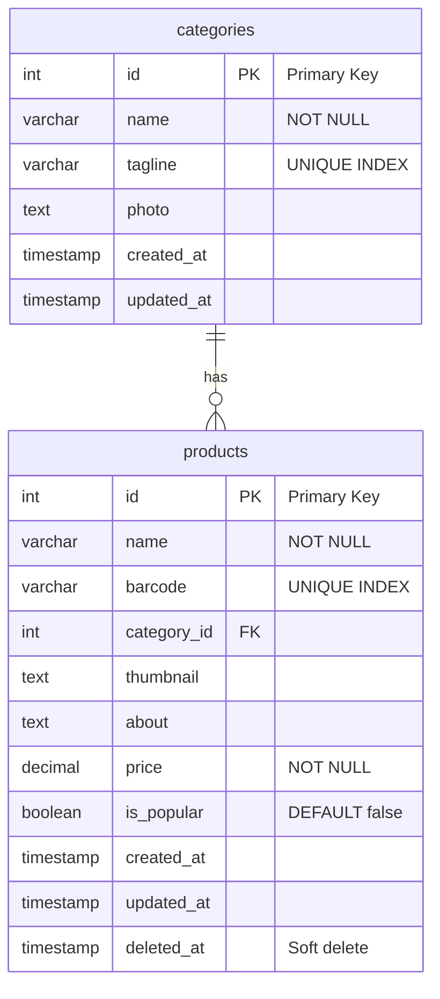

### 6.2 Table Definitions

**categories table:**
| Column | Type | Constraints | Description |
|--------|------|-------------|-------------|
| id | SERIAL | PRIMARY KEY | Auto-increment ID |
| name | VARCHAR(100) | NOT NULL | Category name |
| tagline | VARCHAR(100) | UNIQUE INDEX | Short tagline |
| photo | TEXT | | Photo URL |
| created_at | TIMESTAMP | | Creation time |
| updated_at | TIMESTAMP | | Last update time |

**products table:**
| Column | Type | Constraints | Description |
|--------|------|-------------|-------------|
| id | SERIAL | PRIMARY KEY | Auto-increment ID |
| name | VARCHAR(100) | NOT NULL | Product name |
| barcode | VARCHAR(100) | UNIQUE INDEX | Unique barcode |
| category_id | INTEGER | FOREIGN KEY | Reference to categories.id |
| thumbnail | TEXT | | Image URL |
| about | TEXT | | Description |
| price | DECIMAL | NOT NULL | Product price |
| is_popular | BOOLEAN | DEFAULT false | Popular flag |
| created_at | TIMESTAMP | | Creation time |
| updated_at | TIMESTAMP | | Last update time |
| deleted_at | TIMESTAMP | | Soft delete marker |

### 6.3 Soft Delete Mechanism

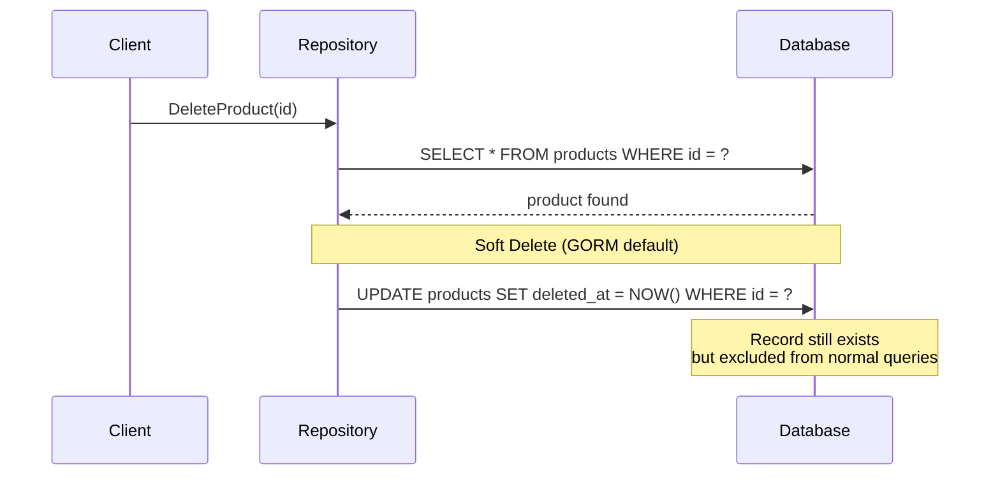

GORM automatically adds `WHERE deleted_at IS NULL` to all queries, so "deleted" records are hidden.

---

## 7. External Integrations

### 7.1 Service Communication

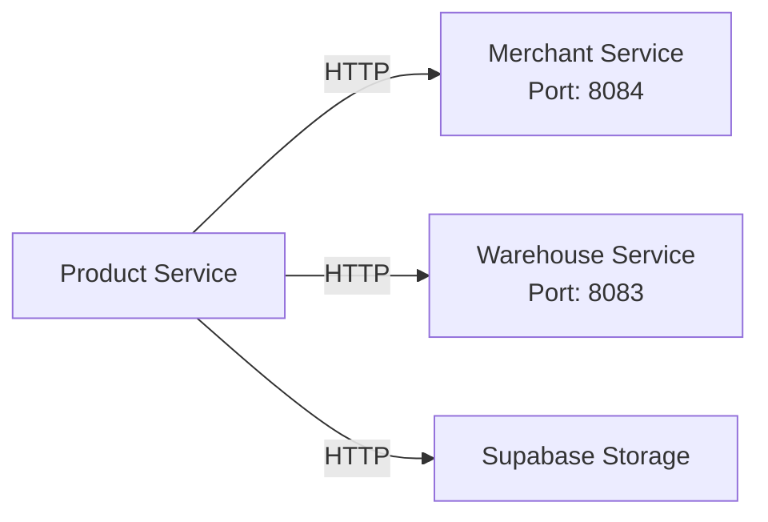

### 7.2 API Contract

**Merchant Service:**
| Endpoint | Method | Purpose |
|----------|--------|---------|
| `/api/v1/merchant-products/{id}/total-stock` | GET | Get product stock across all merchants |
| `/api/v1/merchant-products/product/{id}` | DELETE | Remove product from all merchants |

**Warehouse Service:**
| Endpoint | Method | Purpose |
|----------|--------|---------|
| `/api/v1/warehouse-products/detail/products/{id}/total-stock` | GET | Get product stock across all warehouses |
| `/api/v1/warehouse-products/detail/products/{id}` | DELETE | Remove product from all warehouses |

### 7.3 External Client Pattern

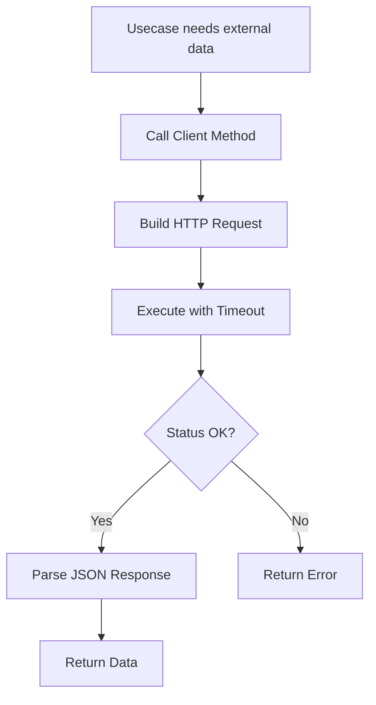

---

## 8. Common Patterns

### 8.1 Error Handling by Layer

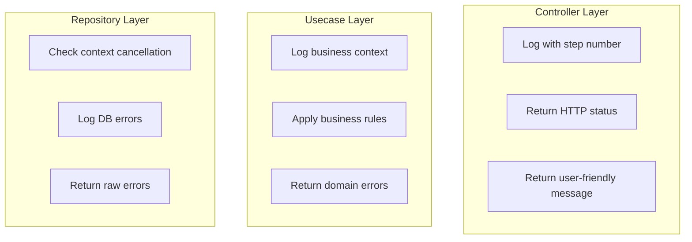

### 8.2 Logging Format

```go
// Pattern: [Component] Method - step: message
log.Errorf("[ProductController] CreateProduct - 1: %v", err)
log.Errorf("[ProductRepository] GetAllProducts - 2: %v", err)
log.Errorf("[DeleteProductUsecase] Product %d has stock", id)
```

### 8.3 Naming Conventions

| Type | Convention | Example |
|------|------------|---------|
| Files | snake_case | `product_controller.go` |
| Structs | PascalCase | `ProductController` |
| Interfaces | PascalCase + Interface | `ProductControllerInterface` |
| Methods | PascalCase (exported) | `CreateProduct` |
| Variables | camelCase | `productRepo` |
| Constants | UPPER_SNAKE | `MaxImageSize` |

---

## 9. Adding New Features

### 9.1 Feature Implementation Checklist

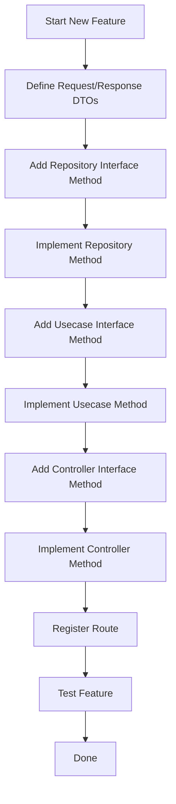

### 9.2 Step-by-Step Example

Let's add `GET /api/v1/products/popular` endpoint:

#### Step 1: Add Repository Method

```go
// repository/product_repository.go

type ProductRepositoryInterface interface {
    // ... existing methods ...
    GetPopularProducts(ctx context.Context, limit int) ([]model.Product, error)
}

func (p *productRepository) GetPopularProducts(ctx context.Context, limit int) ([]model.Product, error) {
    select {
    case <-ctx.Done():
        log.Errorf("[ProductRepository] GetPopularProducts - 1: %v", ctx.Err())
        return nil, ctx.Err()
    default:
        var products []model.Product
        err := p.db.WithContext(ctx).
            Where("is_popular = ?", true).
            Preload("Category").
            Limit(limit).
            Find(&products).Error
        return products, err
    }
}
```

#### Step 2: Add Usecase Method

```go
// usecase/product_usecase.go

type ProductUsecaseInterface interface {
    // ... existing methods ...
    GetPopularProducts(ctx context.Context, limit int) ([]model.Product, error)
}

func (p *productUsecase) GetPopularProducts(ctx context.Context, limit int) ([]model.Product, error) {
    if limit <= 0 || limit > 100 {
        limit = 10
    }
    return p.productRepo.GetPopularProducts(ctx, limit)
}
```

#### Step 3: Add Controller Method

```go
// controller/product_controller.go

type ProductControllerInterface interface {
    // ... existing methods ...
    GetPopularProducts(ctx *fiber.Ctx) error
}

func (p *productController) GetPopularProducts(ctx *fiber.Ctx) error {
    limitStr := ctx.Query("limit", "10")
    limit, _ := strconv.Atoi(limitStr)
    
    products, err := p.productUsecase.GetPopularProducts(ctx.Context(), limit)
    if err != nil {
        log.Errorf("[ProductController] GetPopularProducts - 1: %v", err)
        return ctx.Status(500).JSON(fiber.Map{"message": "Failed"})
    }
    
    // Convert to response
    var response []response.ProductResponse
    for _, p := range products {
        response = append(response, response.ProductResponse{
            ID: p.ID,
            Name: p.Name,
            // ...
        })
    }
    
    return ctx.Status(200).JSON(fiber.Map{
        "message": "Success",
        "data": response,
    })
}
```

#### Step 4: Register Route

```go
// app/routes.go

func SetupRoutes(app *fiber.App, container *Container) {
    api := app.Group("/api/v1")
    
    products := api.Group("/products")
    // ... existing routes ...
    products.Get("/popular", container.ProductController.GetPopularProducts)
}
```

---

## 10. Troubleshooting

### 10.1 Common Issues

| Issue | Cause | Solution |
|-------|-------|----------|
| `connection refused` | Database not running | Start PostgreSQL |
| `config file not found` | Missing .env | Copy .env.example to .env |
| `port already in use` | Port 8082 occupied | Change APP_PORT or kill process |
| `timeout` | External service down | Check merchant/warehouse service |
| `validation failed` | Missing required fields | Check request body |

### 10.2 Debug Tips

```go
// Enable detailed logging
log.Printf("Debug: %+v", myStruct)  // Print struct with fields

// Check context
if ctx.Err() != nil {
    log.Printf("Context error: %v", ctx.Err())
}

// Database debug mode
// In database/postgres_database.go
 db, err := gorm.Open(postgres.Open(connString), &gorm.Config{
     Logger: logger.Default.LogMode(logger.Info),  // Log all SQL
 })
```

### 10.3 API Testing Examples

```bash
# Create product
curl -X POST http://localhost:8082/api/v1/products \
  -H "Content-Type: application/json" \
  -d '{
    "name": "MacBook Pro",
    "barcode": "MBP2024001",
    "price": 25000000,
    "about": "Apple M3 chip",
    "category_id": 1,
    "thumbnail": "https://..."
  }'

# Get all products with pagination
curl "http://localhost:8082/api/v1/products?page=1&limit=10&search=laptop"

# Upload image
curl -X POST http://localhost:8082/api/v1/upload/product-image \
  -F "image=@/path/to/image.jpg"

# Delete product
curl -X DELETE http://localhost:8082/api/v1/products/1
```

---

## 📚 Learning Resources

### For Go Beginners
- [A Tour of Go](https://tour.golang.org/)
- [Go by Example](https://gobyexample.com/)
- [Effective Go](https://golang.org/doc/effective_go.html)

### For Frameworks
- [Fiber Documentation](https://docs.gofiber.io/)
- [GORM Guides](https://gorm.io/docs/)
- [Cobra CLI](https://cobra.dev/)

### Architecture
- [Clean Architecture](https://blog.cleancoder.com/uncle-bob/2012/08/13/the-clean-architecture.html)
- [Go Project Layout](https://github.com/golang-standards/project-layout)

---

> **Questions?** Don't hesitate to ask senior engineers. We're here to help you grow! 🚀

*Document generated for Product Service v1.0*
