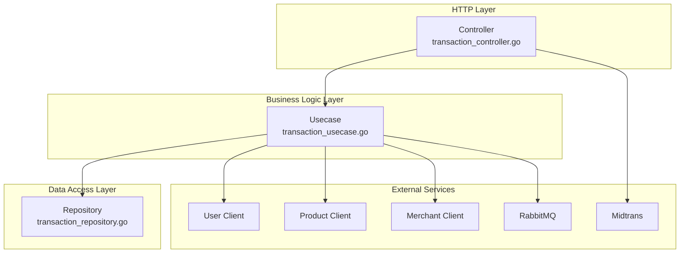
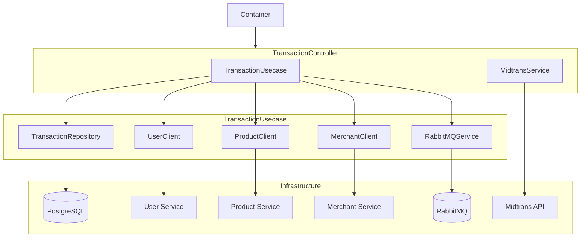
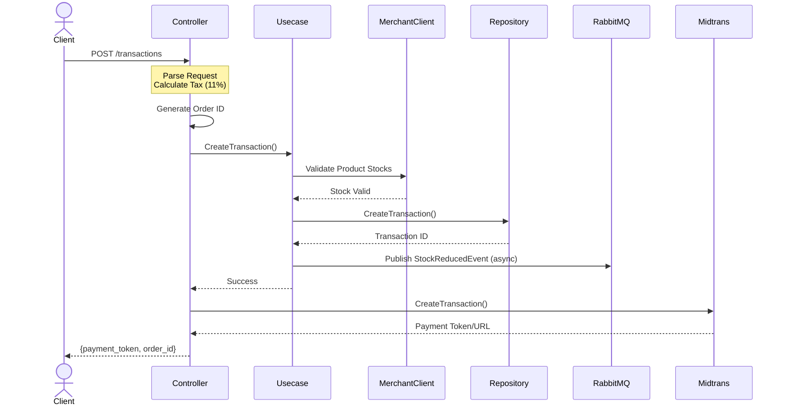
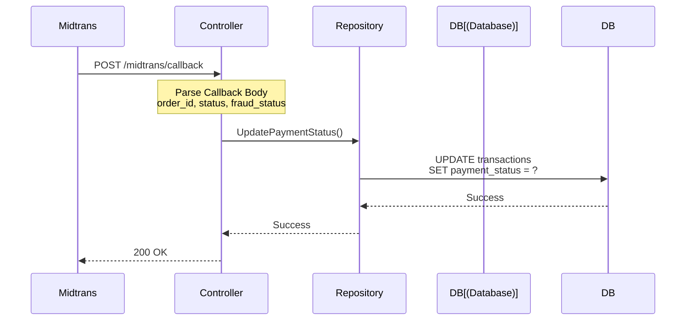
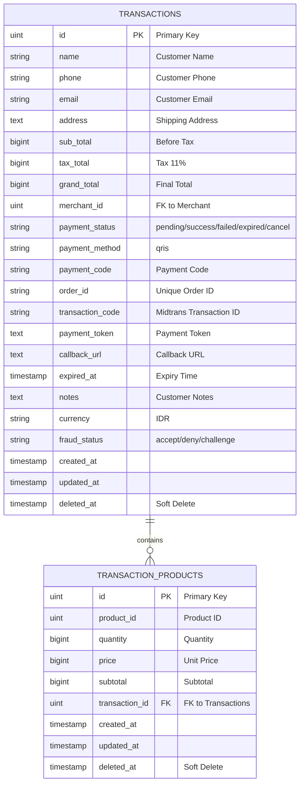
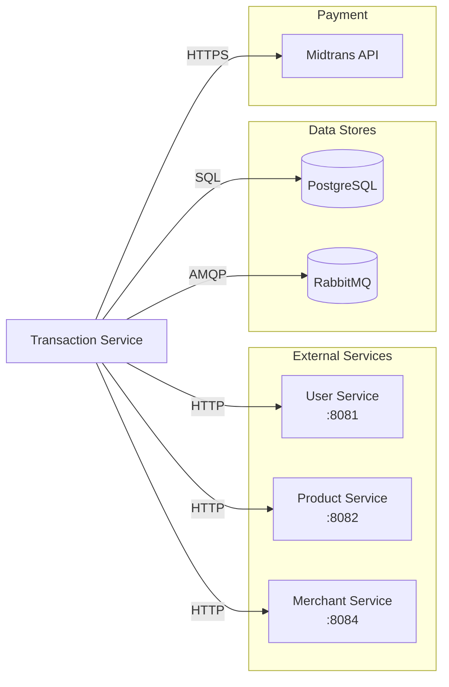
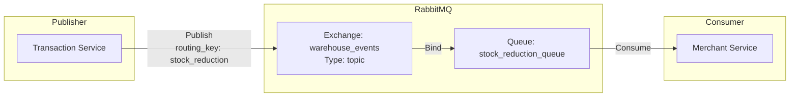
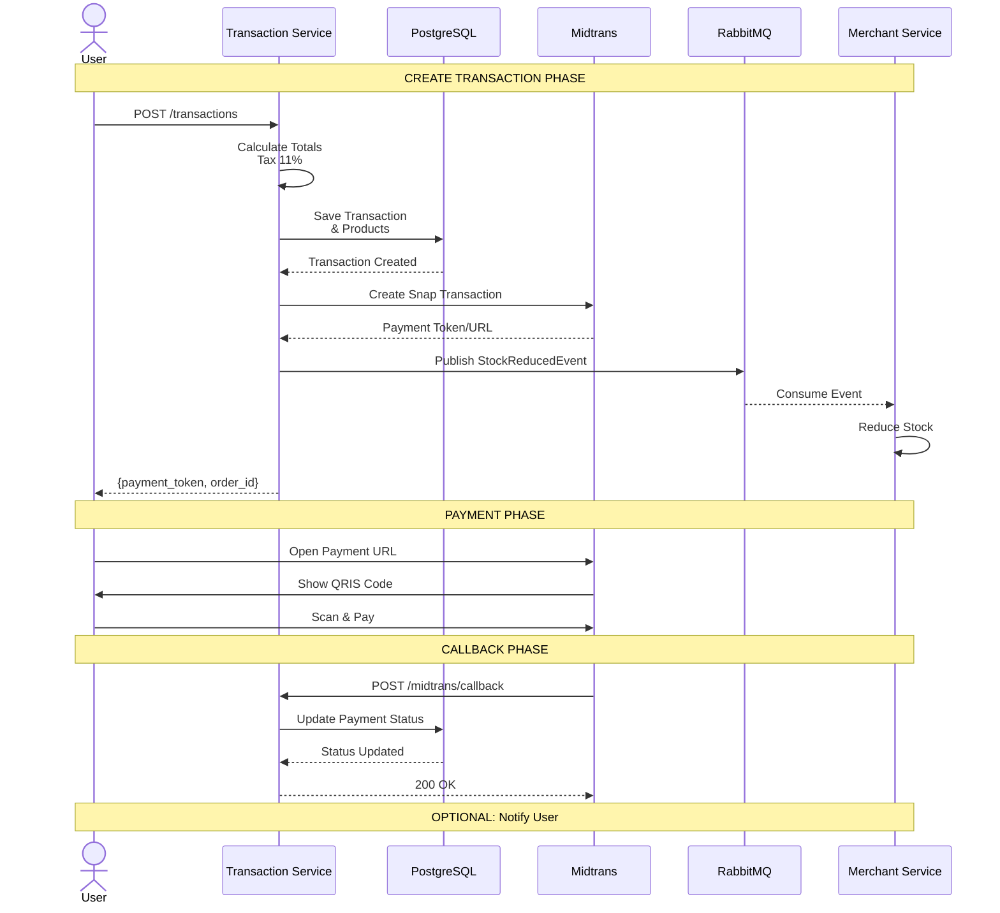
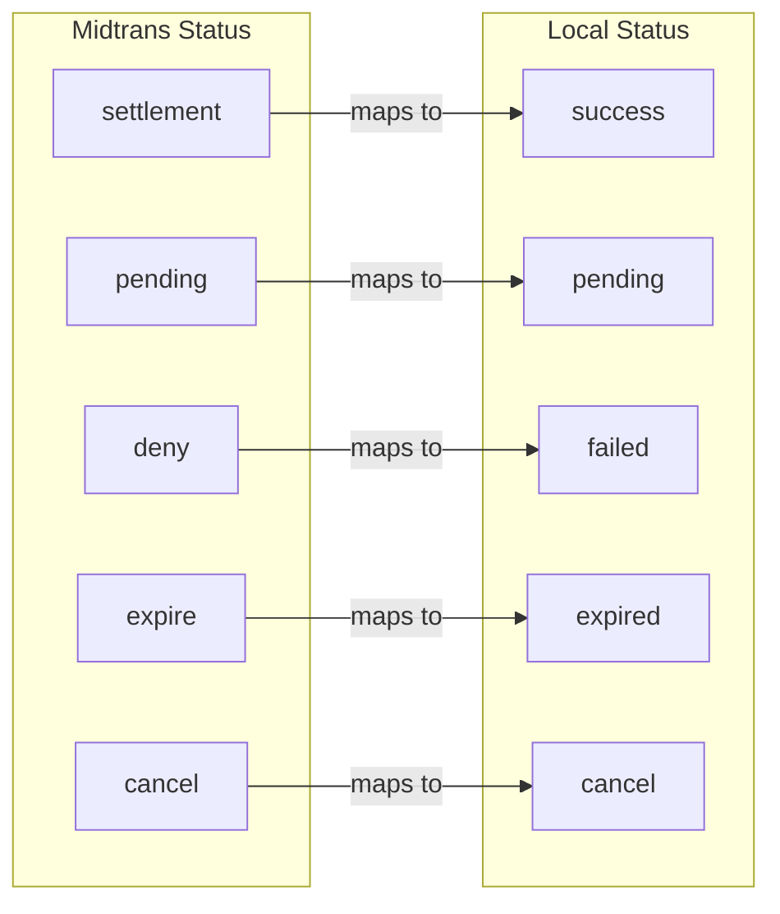
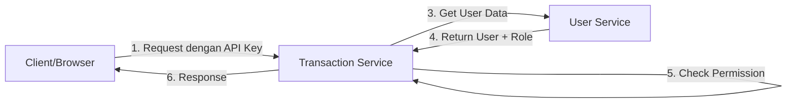

# 📦 Transaction Service

> Microservice untuk mengelola transaksi penjualan, pembayaran, dan integrasi dengan payment gateway Midtrans dalam sistem Micro-Warehouse.

---

## 📋 Daftar Isi

- [Overview](#overview)
- [Arsitektur](#arsitektur)
- [Tech Stack](#tech-stack)
- [Struktur Project](#struktur-project)
- [Alur Bisnis](#alur-bisnis)
- [API Documentation](#api-documentation)
- [Database Schema](#database-schema)
- [Integrasi Service](#integrasi-service)
- [Event-Driven Architecture](#event-driven-architecture)
- [Payment Flow](#payment-flow)
- [Error Handling](#error-handling)
- [Authentication & Authorization](#authentication--authorization)
- [Testing Guide](#testing-guide)
- [Code Examples](#code-examples-untuk-junior-developer)
- [Deployment](#deployment-guide)
- [Security](#security-considerations)
- [Monitoring](#monitoring--health-checks)
- [Getting Started](#getting-started)
- [Konfigurasi](#konfigurasi)

---

## 🎯 Overview

Transaction Service adalah microservice yang bertanggung jawab untuk:

1. **Membuat Transaksi** - Menerima pesanan dari customer dan menghitung total harga (termasuk pajak 11%)
2. **Processing Pembayaran** - Integrasi dengan Midtrans untuk pembayaran QRIS
3. **Manajemen Status Pembayaran** - Handle callback dari Midtrans dan update status transaksi
4. **Dashboard & Reporting** - Menyediakan statistik untuk Manager dan Warehouse Keeper
5. **Event Publishing** - Mengirim event ke RabbitMQ untuk mengurangi stock produk

---

## 🏗️ Arsitektur



### Dependency Injection Pattern

Service menggunakan **Container Pattern** untuk dependency injection di `app/container.go`:



---

## 🛠️ Tech Stack

| Komponen | Teknologi |
|----------|-----------|
| Language | Go 1.25.5 |
| HTTP Framework | Fiber v2 |
| ORM | GORM |
| Database | PostgreSQL |
| Message Broker | RabbitMQ |
| Payment Gateway | Midtrans |
| CLI Framework | Cobra |
| Configuration | Viper |
| Logging | Zerolog |

---

## 📁 Struktur Project

```
transaction-service/
├── cmd/                          # CLI Commands (Cobra)
│   ├── root.go                   # Root command & config init
│   └── start.go                  # Start server command
│
├── app/                          # Application Bootstrap
│   ├── app.go                    # Server setup & middleware
│   ├── container.go              # Dependency injection
│   └── routes.go                 # HTTP route definitions
│
├── configs/                      # Configuration
│   └── config.go                 # Config structs & Viper setup
│
├── controller/                   # HTTP Handlers
│   ├── request/                  # Request DTOs
│   │   └── transaction_request.go
│   ├── response/                 # Response DTOs
│   │   └── transaction_response.go
│   └── transaction_controller.go
│
├── usecase/                      # Business Logic
│   └── transaction_usecase.go
│
├── repository/                   # Data Access Layer
│   └── transaction_repository.go
│
├── model/                        # Database Models (GORM)
│   ├── transaction_model.go
│   └── transaction_product_model.go
│
├── database/                     # Database Connection
│   └── postgres_database.go
│
├── pkg/                          # Shared Packages
│   ├── conv/                     # Type conversion utilities
│   │   └── conv.go
│   ├── httpclient/               # HTTP clients for other services
│   │   ├── user_client.go
│   │   ├── product_client.go
│   │   └── merchant_client.go
│   ├── midtrans/                 # Midtrans integration
│   │   └── midtrans_service.go
│   ├── rabbitmq/                 # RabbitMQ publisher
│   │   ├── rabbitmq_service.go
│   │   └── consumer.go
│   ├── pagination/               # Pagination utilities
│   │   └── pagination.go
│   └── validator/                # Request validation
│       └── request_validator.go
│
├── .env                          # Environment configuration
├── go.mod                        # Go module definition
├── go.sum                        # Go module checksums
└── main.go                       # Application entry point
```

---

## 🔄 Alur Bisnis

### 1. Create Transaction Flow



### 2. Payment Callback Flow



---

## 📚 API Documentation

### Base URL
```
http://localhost:8085/api/v1
```

### Endpoints

#### 1. Create Transaction

**Endpoint:** `POST /transactions`

**Request Body:**
```json
{
  "name": "John Doe",
  "phone": "081234567890",
  "email": "john@example.com",
  "address": "Jl. Mawar No. 123, Jakarta",
  "merchant_id": 1,
  "notes": "Tolong dikemas rapi",
  "products": [
    {
      "product_id": 1,
      "quantity": 2,
      "price": 50000
    },
    {
      "product_id": 2,
      "quantity": 1,
      "price": 75000
    }
  ]
}
```

**Response Success (200):**
```json
{
  "message": "Transaction created successfully",
  "data": {
    "payment_token": "https://app.sandbox.midtrans.com/snap/v3/redirection/xxx",
    "order_id": "ORDER_1701234567_1"
  }
}
```

> **Catatan:** Pajak dihitung otomatis 11% dari subtotal

---

#### 2. Get All Transactions

**Endpoint:** `GET /transactions`

**Query Parameters:**

| Parameter | Type | Default | Description |
|-----------|------|---------|-------------|
| page | int | 1 | Halaman yang diinginkan |
| limit | int | 10 | Jumlah item per halaman |
| search | string | - | Cari berdasarkan nama/phone customer |
| sort_by | string | created_at | Urutkan berdasarkan: id, name, created_at |
| sort_order | string | desc | asc atau desc |
| merchant_id | string | - | Filter berdasarkan merchant |

**Response Success (200):**
```json
{
  "data": {
    "transactions": [
      {
        "id": 1,
        "name": "John Doe",
        "phone": "081234567890",
        "email": "john@example.com",
        "address": "Jl. Mawar No. 123",
        "sub_total": 175000,
        "tax_total": 19250,
        "grand_total": 194250,
        "merchant_id": 1,
        "merchant_name": "Toko Sejahtera",
        "payment_status": "pending",
        "payment_method": "qris",
        "transaction_code": "",
        "order_id": "ORDER_1701234567_1",
        "notes": "Tolong dikemas rapi",
        "transaction_products": [
          {
            "id": 1,
            "product_id": 1,
            "product_name": "Produk A",
            "product_photo": "https://example.com/photo.jpg",
            "product_about": "Deskripsi produk",
            "quantity": 2,
            "price": 50000,
            "sub_total": 100000,
            "transaction_id": 1,
            "category": {
              "id": 1,
              "name": "Elektronik",
              "photo": "https://example.com/cat.jpg"
            }
          }
        ]
      }
    ],
    "pagination": {
      "current_page": 1,
      "total_pages": 5,
      "total_records": 50,
      "limit": 10,
      "has_next": true,
      "has_prev": false
    }
  },
  "message": "Transactions fetched successfully"
}
```

---

#### 3. Midtrans Callback

**Endpoint:** `POST /midtrans/callback`

**Request Body:**
```json
{
  "order_id": "ORDER_1701234567_1",
  "transaction_id": "TRX-12345",
  "transaction_status": "settlement",
  "payment_type": "qris",
  "fraud_status": "accept",
  "status_code": "200",
  "signature_key": "xxx"
}
```

**Response Success (200):**
```json
{
  "message": "Payment status updated successfully"
}
```

---

#### 4. Get Manager Dashboard

**Endpoint:** `GET /dashboards/manager`

**Response Success (200):**
```json
{
  "data": {
    "total_revenue": 5000000,
    "total_transactions": 150,
    "products_sold": 320
  },
  "message": "Dashboard stats fetched successfully"
}
```

---

#### 5. Get Keeper Dashboard by Merchant

**Endpoint:** `GET /dashboards/keeper/merchant/:merchant_id`

**Response Success (200):**
```json
{
  "data": {
    "total_revenue": 2000000,
    "total_transactions": 75,
    "products_sold": 150,
    "merchant": {
      "id": 1,
      "name": "Toko Sejahtera",
      "total_revenue": 2000000,
      "total_transactions": 75,
      "products_sold": 150
    }
  },
  "message": "Dashboard stats fetched successfully"
}
```

---

## 🗄️ Database Schema

### ERD (Entity Relationship Diagram)



### Tabel: `transactions`

| Field | Type | Description |
|-------|------|-------------|
| id | uint (PK) | ID auto increment |
| name | varchar(255) | Nama customer |
| phone | varchar(20) | Nomor telepon customer |
| email | varchar(255) | Email customer |
| address | text | Alamat pengiriman |
| sub_total | bigint | Total harga sebelum pajak |
| tax_total | bigint | Pajak (11%) |
| grand_total | bigint | Total akhir |
| merchant_id | bigint | ID merchant |
| payment_status | varchar(50) | pending/success/failed/expired/cancel |
| payment_method | varchar(50) | qris |
| payment_code | varchar(100) | Kode pembayaran |
| order_id | varchar(100) | Order ID unik untuk Midtrans |
| transaction_code | varchar(100) | Transaction ID dari Midtrans |
| payment_token | text | Token pembayaran Midtrans |
| callback_url | text | URL callback |
| expired_at | timestamp | Waktu expired transaksi |
| notes | text | Catatan customer |
| currency | varchar(10) | IDR |
| fraud_status | varchar(50) | accept/deny/challenge |
| created_at | timestamp | Waktu pembuatan |
| updated_at | timestamp | Waktu update |
| deleted_at | timestamp | Soft delete |

### Tabel: `transaction_products`

| Field | Type | Description |
|-------|------|-------------|
| id | uint (PK) | ID auto increment |
| product_id | bigint | ID produk |
| quantity | bigint | Jumlah produk |
| price | bigint | Harga satuan |
| sub_total | bigint | Subtotal (price × quantity) |
| transaction_id | bigint (FK) | ID transaksi |
| created_at | timestamp | Waktu pembuatan |
| updated_at | timestamp | Waktu update |
| deleted_at | timestamp | Soft delete |

---

## 🔌 Integrasi Service

### Service Communication Diagram



### 1. User Service

**Base URL:** `URL_USER_SERVICE` (default: http://localhost:8081)

| Endpoint | Method | Description |
|----------|--------|-------------|
| `/api/v1/users/{id}` | GET | Get user detail untuk validasi role |

**Response:**
```json
{
  "message": "Success",
  "data": {
    "id": 1,
    "name": "Manager A",
    "email": "manager@example.com",
    "phone": "081234567890",
    "photo": "https://example.com/photo.jpg",
    "role_name": "Manager"
  }
}
```

### 2. Product Service

**Base URL:** `URL_PRODUCT_SERVICE` (default: http://localhost:8082)

| Endpoint | Method | Description |
|----------|--------|-------------|
| `/api/v1/products/{id}` | GET | Get detail produk |
| `/api/v1/products/barcode/{barcode}` | GET | Get produk by barcode |
| `/api/v1/products` | GET | List produk |

### 3. Merchant Service

**Base URL:** `URL_MERCHANT_SERVICE` (default: http://localhost:8084)

| Endpoint | Method | Description |
|----------|--------|-------------|
| `/api/v1/merchants/{id}` | GET | Get merchant detail |
| `/api/v1/merchants?keeper_id={id}` | GET | Get merchant by keeper |
| `/api/v1/merchant-products?merchant_id={id}` | GET | Get produk merchant |
| `/api/v1/merchant-products?merchant_id={id}&product_id={pid}` | GET | Get stock produk |

---

## 📡 Event-Driven Architecture

### RabbitMQ Topology



### RabbitMQ Configuration

| Property | Value |
|----------|-------|
| Exchange | `warehouse_events` |
| Type | `topic` |
| Queue | `stock_reduction_queue` |
| Routing Key | `stock_reduction` |

### Event: StockReducedEvent

**Event Structure:**
```go
type StockReducedEvent struct {
    MerchantID uint                      `json:"merchant_id"`
    Products   []StockReducedEventProduct `json:"products"`
    OrderID    string                    `json:"order_id"`
    Timestamp  time.Time                 `json:"timestamp"`
}

type StockReducedEventProduct struct {
    ProductID uint `json:"product_id"`
    Quantity  int  `json:"quantity"`
}
```

**Example Payload:**
```json
{
  "merchant_id": 1,
  "products": [
    {
      "product_id": 1,
      "quantity": 2
    },
    {
      "product_id": 2,
      "quantity": 1
    }
  ],
  "order_id": "ORDER_1701234567_1",
  "timestamp": "2024-01-01T12:00:00Z"
}
```

**Flow:**
1. Transaction dibuat dan tersimpan di database
2. Event dipublish ke RabbitMQ (async/non-blocking)
3. Consumer (Merchant Service) menerima event dan mengurangi stock

---

## 💳 Payment Flow

### Midtrans Integration

**Environment:**
- Sandbox: `https://app.sandbox.midtrans.com`
- Production: `https://app.midtrans.com`

**Payment Method:**
- QRIS (Quick Response Code Indonesian Standard)

### Complete Payment Flow



### Status Mapping



| Midtrans Status | Local Status | Description |
|-----------------|--------------|-------------|
| settlement | success | Pembayaran berhasil |
| pending | pending | Menunggu pembayaran |
| deny | failed | Pembayaran ditolak |
| expire | expired | Transaksi expired |
| cancel | cancel | Transaksi dibatalkan |

---

## 🚀 Getting Started

### Prerequisites

- Go 1.25.5 atau lebih baru
- PostgreSQL (running on port 5434)
- RabbitMQ (running on port 5672)
- User Service, Product Service, Merchant Service berjalan

### Installation

```bash
# Clone repository
git clone <repository-url>
cd transaction-service

# Install dependencies
go mod download
go mod verify

# Setup environment
cp .env.example .env
# Edit .env sesuai konfigurasi Anda
```

### Menjalankan Service

```bash
# Development mode
go run main.go

# Atau explicit start command
go run main.go start

# Dengan custom config file
go run main.go --config=/path/to/config.env
```

### Build Binary

```bash
# Build
go build -o transaction-service main.go

# Run binary
./transaction-service
```

---

## ⚙️ Konfigurasi

### Environment Variables (.env)

```env
# Application
APP_ENV="development"
APP_PORT=8085

# Database
DATABASE_PORT=5434
DATABASE_HOST=localhost
DATABASE_USER=postgres
DATABASE_PASSWORD=lokal
DATABASE_NAME=warehouse_transaction_db
DATABASE_MAX_OPEN_CONNECTION=100
DATABASE_MAX_IDLE_CONNECTION=20

# Redis (reserved untuk future use)
REDIS_HOST=localhost
REDIS_PORT=6379

# RabbitMQ
RABBITMQ_HOST=localhost
RABBITMQ_PORT=5672
RABBITMQ_USER=guest
RABBITMQ_PASSWORD=guest

# External Services
URL_USER_SERVICE="http://localhost:8081"
URL_PRODUCT_SERVICE="http://localhost:8082"
URL_MERCHANT_SERVICE="http://localhost:8084"

# Midtrans (Sandbox keys)
MIDTRANS_SERVER_KEY=Mid-server-xxxxx
MIDTRANS_CLIENT_KEY=Mid-client-xxxxx
MIDTRANS_MERCHANT_ID=Gxxxxx
MIDTRANS_IS_PRODUCTION=false
```

---

## 🧪 Testing dengan curl

### Create Transaction

```bash
curl -X POST http://localhost:8085/api/v1/transactions \
  -H "Content-Type: application/json" \
  -d '{
    "name": "John Doe",
    "phone": "081234567890",
    "email": "john@example.com",
    "address": "Jl. Mawar No. 123",
    "merchant_id": 1,
    "products": [
      {
        "product_id": 1,
        "quantity": 2,
        "price": 50000
      }
    ]
  }'
```

### Get Transactions

```bash
# Basic
curl http://localhost:8085/api/v1/transactions

# Dengan pagination dan search
curl "http://localhost:8085/api/v1/transactions?page=1&limit=10&search=john&sort_by=created_at&sort_order=desc"

# Filter by merchant
curl "http://localhost:8085/api/v1/transactions?merchant_id=1"
```

### Simulate Midtrans Callback

```bash
curl -X POST http://localhost:8085/api/v1/midtrans/callback \
  -H "Content-Type: application/json" \
  -d '{
    "order_id": "ORDER_1701234567_1",
    "transaction_id": "TRX-12345",
    "transaction_status": "settlement",
    "payment_type": "qris",
    "fraud_status": "accept",
    "status_code": "200",
    "signature_key": "test-signature"
  }'
```

---

## 📝 Notes Penting

1. **Pajak:** Pajak dihitung otomatis 11% dari subtotal transaksi

2. **Order ID Format:** `ORDER_{timestamp}_{merchant_id}`
   - Contoh: `ORDER_1701234567_1`

3. **Stock Validation:** Stock dicek sebelum transaksi dibuat. Jika stock tidak mencukupi, transaksi akan ditolak.

4. **Async Event:** Publishing event ke RabbitMQ dilakukan secara asynchronous (goroutine) agar tidak memblok response ke client.

5. **Data Enrichment:** Saat mengambil list transaksi, service akan meng-enrich data dengan:
   - Detail produk dari Product Service
   - Detail merchant dari Merchant Service

6. **Authorization:** Dashboard endpoints memerlukan user dengan role "Manager". Validasi dilakukan via User Service.

7. **Soft Delete:** Semua data menggunakan soft delete (GORM `DeletedAt`)

---

## 🔧 Troubleshooting

### Database Connection Error
```
Check:
- PostgreSQL running di port 5434
- Credential database benar
- Database warehouse_transaction_db sudah dibuat
```

### RabbitMQ Connection Error
```
Check:
- RabbitMQ running di port 5672
- Username/password benar (default: guest/guest)
- Exchange dan queue sudah dideklarasikan
```

### Midtrans Integration Error
```
Check:
- Server key dan client key benar
- IsProduction setting sesuai environment
- Network dapat mengakses Midtrans API
```

### Service Dependencies Error
```
Check:
- User Service running di port 8081
- Product Service running di port 8082
- Merchant Service running di port 8084
```

---

## ❌ Error Handling

### HTTP Status Codes

| Status Code | Meaning | When Occurs |
|-------------|---------|-------------|
| 200 | OK | Request berhasil |
| 400 | Bad Request | Validation error, invalid JSON |
| 401 | Unauthorized | Missing/invalid authentication |
| 403 | Forbidden | User tidak punya permission |
| 404 | Not Found | Resource tidak ditemukan |
| 422 | Unprocessable Entity | Business logic error (stock habis, dll) |
| 500 | Internal Server Error | Server error, database down, etc |

### Error Response Format

Semua error response mengikuti format:

```json
{
  "message": "Error description",
  "error": "ERROR_CODE",
  "details": {} // Optional, untuk validation errors
}
```

### Contoh Error Responses

#### 400 - Bad Request (Validation Error)
```json
{
  "message": "Invalid request body",
  "error": "VALIDATION_ERROR",
  "details": {
    "name": "Name is required",
    "phone": "Phone is required",
    "merchant_id": "Merchant ID must be greater than 0"
  }
}
```

#### 400 - Bad Request (Insufficient Stock)
```json
{
  "message": "stock tidak mencukupi untuk product 'Laptop ASUS'. Dibutuhkan: 5, Tersedia: 2",
  "error": "INSUFFICIENT_STOCK"
}
```

#### 401 - Unauthorized
```json
{
  "message": "Authentication required",
  "error": "UNAUTHORIZED"
}
```

#### 403 - Forbidden (Bukan Manager)
```json
{
  "message": "akses ditolak: user bukan manager",
  "error": "FORBIDDEN"
}
```

#### 404 - Transaction Not Found
```json
{
  "message": "Transaction not found",
  "error": "NOT_FOUND"
}
```

#### 500 - Internal Server Error
```json
{
  "message": "Internal Server Error",
  "error": "INTERNAL_ERROR"
}
```

---

## 🔐 Authentication & Authorization

### Overview

Service ini menggunakan **API Key-based authentication** untuk komunikasi antar service, dan **User Service validation** untuk authorization.



### API Key Authentication

**Header:** `X-API-Key: your-api-key`

```bash
curl -X GET http://localhost:8085/api/v1/transactions \
  -H "X-API-Key: your-secret-api-key"
```

### Authorization Flow

1. **Dashboard Endpoints** - Memerlukan role "Manager"
2. **Create Transaction** - Bisa diakses oleh semua authenticated user
3. **Get Transactions** - Bisa difilter berdasarkan merchant_id

### Permission Matrix

| Endpoint | Manager | Keeper | Customer |
|----------|---------|--------|----------|
| POST /transactions | ✅ | ✅ | ✅ |
| GET /transactions | ✅ (all) | ✅ (own merchant) | ❌ |
| GET /dashboards/manager | ✅ | ❌ | ❌ |
| GET /dashboards/keeper/* | ✅ | ✅ (own) | ❌ |
| POST /midtrans/callback | 🔓 Public | 🔓 Public | 🔓 Public |

---

## 🧪 Testing Guide

### Prerequisites

```bash
# Install testing dependencies
go get github.com/stretchr/testify
go get github.com/golang/mock/mockgen
```

### Running Tests

```bash
# Run all tests
go test ./...

# Run tests with verbose output
go test -v ./...

# Run tests with coverage
go test -cover ./...

# Run tests with coverage report
go test -coverprofile=coverage.out ./...
go tool cover -html=coverage.out -o coverage.html

# Run specific package test
go test ./usecase/...
go test ./repository/...

# Run with race detector
go test -race ./...
```

### Test Structure

```
transaction-service/
├── usecase/
│   ├── transaction_usecase.go
│   └── transaction_usecase_test.go      # Unit test
├── repository/
│   ├── transaction_repository.go
│   └── transaction_repository_test.go   # Unit test
└── mocks/                               # Generated mocks
    ├── mock_repository.go
    └── mock_httpclient.go
```

### Writing Unit Tests (Contoh)

```go
// usecase/transaction_usecase_test.go
package usecase

import (
    "context"
    "testing"
    
    "github.com/stretchr/testify/assert"
    "github.com/stretchr/testify/mock"
    "micro-warehouse/transaction-service/model"
)

func TestCreateTransaction_Success(t *testing.T) {
    // Arrange
    mockRepo := new(MockTransactionRepository)
    mockMerchantClient := new(MockMerchantClient)
    
    usecase := NewTransactionUsecase(
        mockRepo,
        mockMerchantClient,
        nil, // rabbitMQ
        nil, // productClient
        nil, // userClient
    )
    
    transaction := model.Transaction{
        Name:       "John Doe",
        Phone:      "081234567890",
        MerchantID: 1,
        GrandTotal: 100000,
    }
    
    // Mock expectations
    mockMerchantClient.On("GetMerchantProductStock", mock.Anything, uint(1), uint(1)).
        Return(&httpclient.MerchantProduct{Stock: 10}, nil)
    mockRepo.On("CreateTransaction", mock.Anything, transaction).
        Return(int64(1), nil)
    
    // Act
    id, err := usecase.CreateTransaction(context.Background(), transaction)
    
    // Assert
    assert.NoError(t, err)
    assert.Equal(t, int64(1), id)
    mockRepo.AssertExpectations(t)
}
```

### Generate Mocks

```bash
# Install mockgen
go install github.com/golang/mock/mockgen@latest

# Generate mock untuk repository
mockgen -source=repository/transaction_repository.go \
  -destination=mocks/mock_repository.go \
  -package=mocks

# Generate mock untuk httpclient
mockgen -source=pkg/httpclient/merchant_client.go \
  -destination=mocks/mock_merchant_client.go \
  -package=mocks
```

### Integration Testing

```bash
# Setup test database
docker run -d \
  --name test-postgres \
  -e POSTGRES_PASSWORD=test \
  -e POSTGRES_DB=test_db \
  -p 5435:5432 \
  postgres:15

# Run integration tests
go test -tags=integration ./...
```

---

## 💻 Code Examples untuk Junior Developer

### Pattern 1: Layered Architecture

#### Controller Layer (HTTP Handler)
```go
// Tanggung jawab: Handle HTTP request/response
// Tidak boleh ada business logic di sini

func (c *transactionController) CreateTransaction(ctx *fiber.Ctx) error {
    // 1. Parse request
    var req request.CreateTransactionRequest
    if err := ctx.BodyParser(&req); err != nil {
        return ctx.Status(400).JSON(fiber.Map{"message": "Invalid body"})
    }
    
    // 2. Call usecase
    result, err := c.transactionUsecase.CreateTransaction(ctx.Context(), req)
    if err != nil {
        return ctx.Status(500).JSON(fiber.Map{"message": err.Error()})
    }
    
    // 3. Return response
    return ctx.Status(200).JSON(fiber.Map{
        "data": result,
        "message": "Success",
    })
}
```

#### Usecase Layer (Business Logic)
```go
// Tanggung jawab: Business logic, orchestration
// Tidak boleh langsung akses database

func (u *transactionUsecase) CreateTransaction(ctx context.Context, req request.CreateTransactionRequest) (*model.Transaction, error) {
    // 1. Validasi bisnis
    if err := u.validateStock(ctx, req); err != nil {
        return nil, err
    }
    
    // 2. Hitung total
    transaction := u.calculateTotals(req)
    
    // 3. Simpan ke DB via repository
    id, err := u.transactionRepo.CreateTransaction(ctx, transaction)
    if err != nil {
        return nil, err
    }
    
    // 4. Publish event (async)
    go u.publishEvent(ctx, transaction)
    
    transaction.ID = uint(id)
    return &transaction, nil
}
```

#### Repository Layer (Data Access)
```go
// Tanggung jawab: Akses database
// Tidak boleh ada business logic

func (r *transactionRepository) CreateTransaction(ctx context.Context, tx model.Transaction) (int64, error) {
    // Gunakan transaction untuk atomicity
    dbTx := r.db.WithContext(ctx).Begin()
    
    if err := dbTx.Create(&tx).Error; err != nil {
        dbTx.Rollback()
        return 0, err
    }
    
    if err := dbTx.Commit().Error; err != nil {
        return 0, err
    }
    
    return int64(tx.ID), nil
}
```

### Pattern 2: Dependency Injection

```go
// app/container.go
// Kenapa DI? Untuk testability dan loose coupling

func BuildContainer() *Container {
    // Infrastructure
    db := database.ConnectionPostgres(cfg)
    rabbitMQ, _ := rabbitmq.NewRabbitMQService(url)
    
    // HTTP Clients
    merchantClient := httpclient.NewMerchantClient(cfg)
    productClient := httpclient.NewProductClient(cfg)
    userClient := httpclient.NewUserCLient(cfg)
    
    // Services
    midtransService := midtrans.NewMidtransService(cfg)
    
    // Repository Layer
    transactionRepo := repository.NewTransactionRepository(db.DB)
    
    // Usecase Layer
    transactionUsecase := usecase.NewTransactionUsecase(
        transactionRepo,
        merchantClient,
        rabbitMQ,
        productClient,
        userClient,
    )
    
    // Controller Layer
    transactionController := controller.NewTransactionController(
        transactionUsecase,
        midtransService,
    )
    
    return &Container{
        TransactionController: transactionController,
    }
}
```

### Pattern 3: Error Handling

```go
//pkg/errors/custom_errors.go
package errors

type AppError struct {
    Code    string `json:"code"`
    Message string `json:"message"`
    Status  int    `json:"status"`
}

func (e *AppError) Error() string {
    return e.Message
}

// Predefined errors
var (
    ErrInsufficientStock = &AppError{
        Code:    "INSUFFICIENT_STOCK",
        Message: "Stock tidak mencukupi",
        Status:  422,
    }
    ErrUnauthorized = &AppError{
        Code:    "UNAUTHORIZED",
        Message: "Akses ditolak",
        Status:  401,
    }
)

// Penggunaan di controller
func (c *controller) Handle(ctx *fiber.Ctx) error {
    result, err := c.usecase.DoSomething(ctx.Context())
    if err != nil {
        if appErr, ok := err.(*errors.AppError); ok {
            return ctx.Status(appErr.Status).JSON(appErr)
        }
        return ctx.Status(500).JSON(fiber.Map{"message": "Internal error"})
    }
    return ctx.JSON(result)
}
```

### Pattern 4: Context Cancellation

```go
// Selalu handle context cancellation untuk graceful shutdown

func (r *repository) LongRunningQuery(ctx context.Context) error {
    select {
    case <-ctx.Done():
        // Request dibatalkan (timeout/cancelled)
        return ctx.Err()
    default:
        // Lanjutkan query
        return r.db.WithContext(ctx).Find(&results).Error
    }
}

// Penggunaan dengan timeout
func (u *usecase) DoSomething(ctx context.Context) error {
    ctx, cancel := context.WithTimeout(ctx, 5*time.Second)
    defer cancel()
    
    return u.repo.LongRunningQuery(ctx)
}
```

---

## 🚀 Deployment Guide

### Docker Deployment

#### Dockerfile

```dockerfile
# Build stage
FROM golang:1.25.5-alpine AS builder

WORKDIR /app

# Install dependencies
COPY go.mod go.sum ./
RUN go mod download

# Copy source code
COPY . .

# Build binary
RUN CGO_ENABLED=0 GOOS=linux go build -a -installsuffix cgo -o main .

# Final stage
FROM alpine:latest

RUN apk --no-cache add ca-certificates

WORKDIR /root/

# Copy binary dari builder
COPY --from=builder /app/main .

# Copy .env file (atau gunakan env vars)
COPY --from=builder /app/.env .

EXPOSE 8085

CMD ["./main"]
```

#### Docker Compose

```yaml
version: '3.8'

services:
  transaction-service:
    build: .
    container_name: transaction-service
    ports:
      - "8085:8085"
    environment:
      - APP_ENV=production
      - APP_PORT=8085
      - DATABASE_HOST=postgres
      - DATABASE_PORT=5432
      - DATABASE_USER=postgres
      - DATABASE_PASSWORD=${DB_PASSWORD}
      - DATABASE_NAME=warehouse_transaction_db
      - RABBITMQ_HOST=rabbitmq
      - RABBITMQ_PORT=5672
      - RABBITMQ_USER=guest
      - RABBITMQ_PASSWORD=guest
      - URL_USER_SERVICE=http://user-service:8081
      - URL_PRODUCT_SERVICE=http://product-service:8082
      - URL_MERCHANT_SERVICE=http://merchant-service:8084
      - MIDTRANS_SERVER_KEY=${MIDTRANS_SERVER_KEY}
      - MIDTRANS_CLIENT_KEY=${MIDTRANS_CLIENT_KEY}
      - MIDTRANS_IS_PRODUCTION=true
    depends_on:
      - postgres
      - rabbitmq
    networks:
      - warehouse-network
    restart: unless-stopped
    healthcheck:
      test: ["CMD", "wget", "--quiet", "--tries=1", "--spider", "http://localhost:8085/health"]
      interval: 30s
      timeout: 10s
      retries: 3

  postgres:
    image: postgres:15-alpine
    container_name: transaction-postgres
    environment:
      - POSTGRES_USER=postgres
      - POSTGRES_PASSWORD=${DB_PASSWORD}
      - POSTGRES_DB=warehouse_transaction_db
    volumes:
      - postgres_data:/var/lib/postgresql/data
    ports:
      - "5434:5432"
    networks:
      - warehouse-network

  rabbitmq:
    image: rabbitmq:3-management-alpine
    container_name: transaction-rabbitmq
    ports:
      - "5672:5672"
      - "15672:15672"
    environment:
      - RABBITMQ_DEFAULT_USER=guest
      - RABBITMQ_DEFAULT_PASS=guest
    networks:
      - warehouse-network

volumes:
  postgres_data:

networks:
  warehouse-network:
    driver: bridge
```

#### Build & Run

```bash
# Build image
docker build -t transaction-service:latest .

# Run dengan docker-compose
docker-compose up -d

# Check logs
docker-compose logs -f transaction-service

# Scale service (jika perlu)
docker-compose up -d --scale transaction-service=3
```

### Production Checklist

- [ ] Gunakan **environment variables** untuk secrets (jangan hardcode)
- [ ] Enable **GORM logging** hanya untuk development
- [ ] Setup **health checks** endpoint
- [ ] Configure **log aggregation** (ELK, Fluentd)
- [ ] Setup **monitoring** (Prometheus + Grafana)
- [ ] Enable **SSL/TLS** untuk production
- [ ] Configure **database connection pooling**
- [ ] Setup **backup strategy** untuk database

---

## 🔒 Security Considerations

### 1. API Key Security

```go
// Middleware untuk validasi API Key
func APIKeyMiddleware(validKeys []string) fiber.Handler {
    return func(c *fiber.Ctx) error {
        apiKey := c.Get("X-API-Key")
        
        if apiKey == "" {
            return c.Status(401).JSON(fiber.Map{
                "message": "API Key required",
            })
        }
        
        valid := false
        for _, key := range validKeys {
            if subtle.ConstantTimeCompare([]byte(apiKey), []byte(key)) == 1 {
                valid = true
                break
            }
        }
        
        if !valid {
            return c.Status(401).JSON(fiber.Map{
                "message": "Invalid API Key",
            })
        }
        
        return c.Next()
    }
}
```

### 2. Input Validation

```go
// Gunakan validator untuk semua input
import "github.com/go-playground/validator/v10"

var validate = validator.New()

type CreateTransactionRequest struct {
    Name    string `json:"name" validate:"required,min=3,max=100"`
    Email   string `json:"email" validate:"required,email"`
    Phone   string `json:"phone" validate:"required,numeric,min=10,max=15"`
    Address string `json:"address" validate:"required,min=10"`
}

func ValidateRequest(req interface{}) error {
    return validate.Struct(req)
}
```

### 3. SQL Injection Prevention

```go
// ✅ Benar - Gunakan parameterized query (GORM otomatis)
result := db.Where("order_id = ?", orderID).First(&transaction)

// ❌ Salah - Jangan gunakan string concatenation
result := db.Where(fmt.Sprintf("order_id = '%s'", orderID)).First(&transaction)
```

### 4. Midtrans Callback Security

```go
// Verifikasi signature key dari Midtrans
func VerifyMidtransSignature(requestBody []byte, signatureKey string) bool {
    // Implementasi verifikasi SHA512
    // Reference: https://docs.midtrans.com/en/technical-reference/signature-key
    
    serverKey := os.Getenv("MIDTRANS_SERVER_KEY")
    expectedSignature := sha512Hash(requestBody + serverKey)
    
    return hmac.Equal(
        []byte(signatureKey),
        []byte(expectedSignature),
    )
}
```

### 5. Sensitive Data

- Jangan log **API Keys**, **Passwords**, **Credit Card** numbers
- Gunakan **environment variables** untuk secrets
- Enable **HTTPS only** di production
- Implementasi **rate limiting** untuk public endpoints

---

## 📊 Monitoring & Health Checks

### Health Check Endpoint

```go
// app/routes.go
func SetupRoutes(app *fiber.App, container *Container) {
    // Health check
    app.Get("/health", func(c *fiber.Ctx) error {
        return c.JSON(fiber.Map{
            "status": "healthy",
            "timestamp": time.Now(),
            "version": "1.0.0",
        })
    })
    
    // Readiness check (cek dependencies)
    app.Get("/ready", container.TransactionController.ReadinessCheck)
}
```

### Readiness Check Implementation

```go
func (t *transactionController) ReadinessCheck(c *fiber.Ctx) error {
    checks := map[string]bool{
        "database":    t.checkDatabase(),
        "rabbitmq":    t.checkRabbitMQ(),
        "user_service": t.checkUserService(),
    }
    
    allReady := true
    for _, ready := range checks {
        if !ready {
            allReady = false
            break
        }
    }
    
    if !allReady {
        return c.Status(503).JSON(fiber.Map{
            "status": "not ready",
            "checks": checks,
        })
    }
    
    return c.JSON(fiber.Map{
        "status": "ready",
        "checks": checks,
    })
}
```

### Metrics (Prometheus)

```go
import "github.com/prometheus/client_golang/prometheus"

var (
    httpRequestsTotal = prometheus.NewCounterVec(
        prometheus.CounterOpts{
            Name: "http_requests_total",
            Help: "Total HTTP requests",
        },
        []string{"method", "endpoint", "status"},
    )
    
    transactionTotal = prometheus.NewCounter(
        prometheus.CounterOpts{
            Name: "transactions_created_total",
            Help: "Total transactions created",
        },
    )
)

// Register metrics
func init() {
    prometheus.MustRegister(httpRequestsTotal)
    prometheus.MustRegister(transactionTotal)
}
```

### Logging Best Practices

```go
// Gunakan structured logging dengan Zerolog
import "github.com/rs/zerolog/log"

// ✅ Benar - Structured logging
log.Info().
    Str("order_id", orderID).
    Int("merchant_id", int(merchantID)).
    Int64("amount", grandTotal).
    Msg("Transaction created successfully")

// ❌ Salah - String concatenation
log.Info("Transaction created: order_id=" + orderID + ", amount=" + string(grandTotal))
```

---

## 📚 Additional Resources

### Tools yang Digunakan

| Tool | Purpose | Link |
|------|---------|------|
| Go | Programming Language | https://golang.org |
| Fiber | Web Framework | https://gofiber.io |
| GORM | ORM | https://gorm.io |
| Viper | Configuration | https://github.com/spf13/viper |
| Zerolog | Logging | https://github.com/rs/zerolog |
| Midtrans | Payment Gateway | https://docs.midtrans.com |

### Learning Resources untuk Junior Dev

1. **Clean Architecture in Go** - https://github.com/bxcodec/go-clean-arch
2. **Go Best Practices** - https://golang.org/doc/effective_go
3. **Microservices Patterns** - https://microservices.io/patterns/index.html
4. **Docker untuk Go** - https://docs.docker.com/language/golang/

---

## 📄 License

MIT License - see [LICENSE](LICENSE) file for details.

---

## 👥 Contributors

| Name | Role | Contact |
|------|------|---------|
| Denis Rahmadi | Backend Engineer | hello.denisrahmadi@gmail.com |

---

*Last Updated: February 2026*
