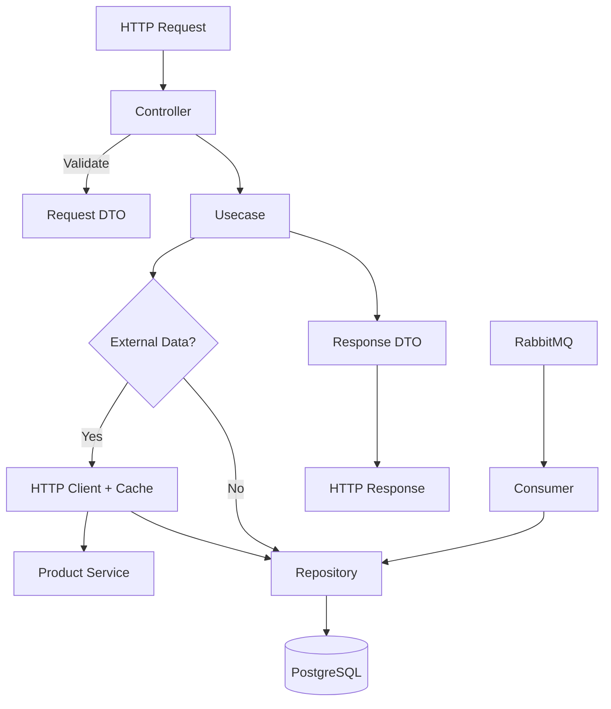
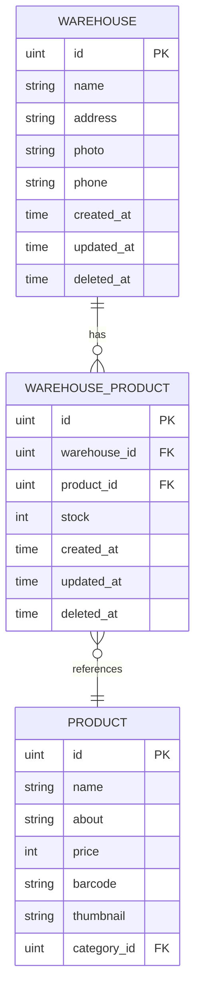
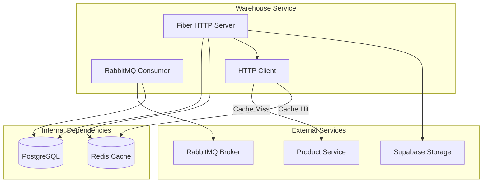
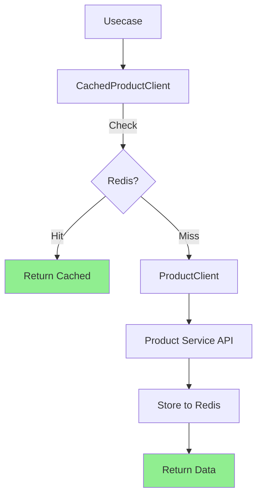
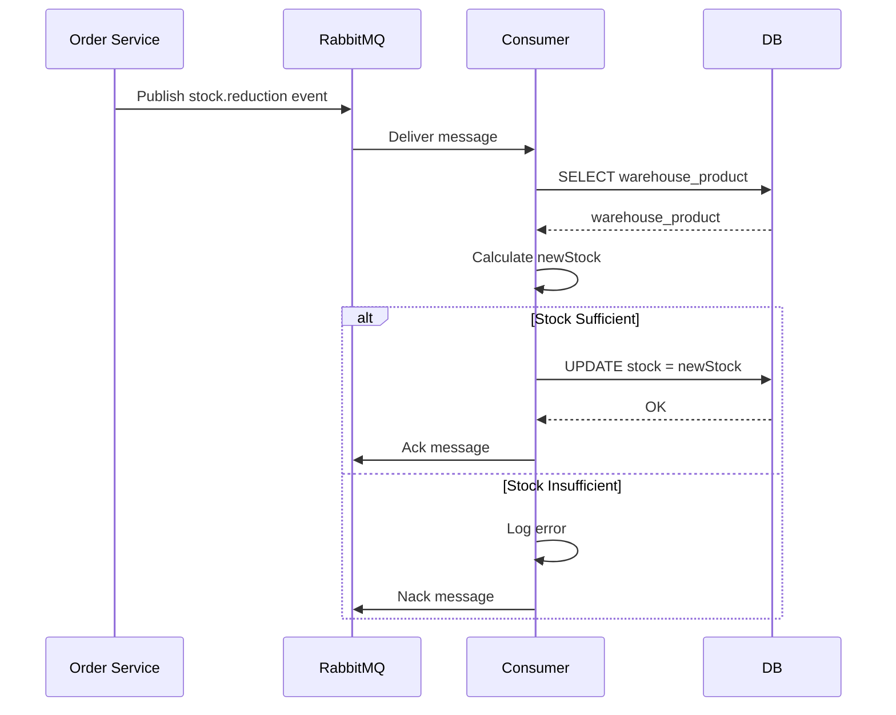
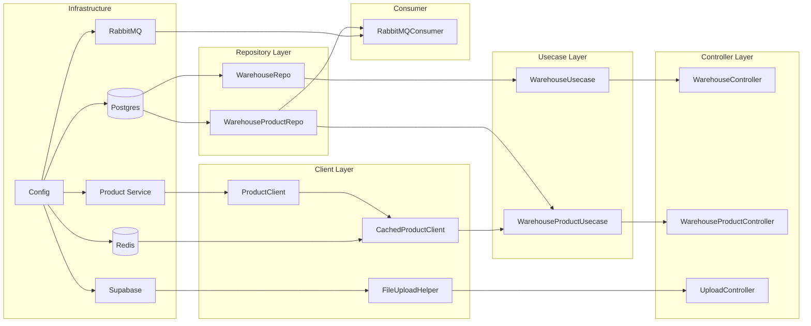
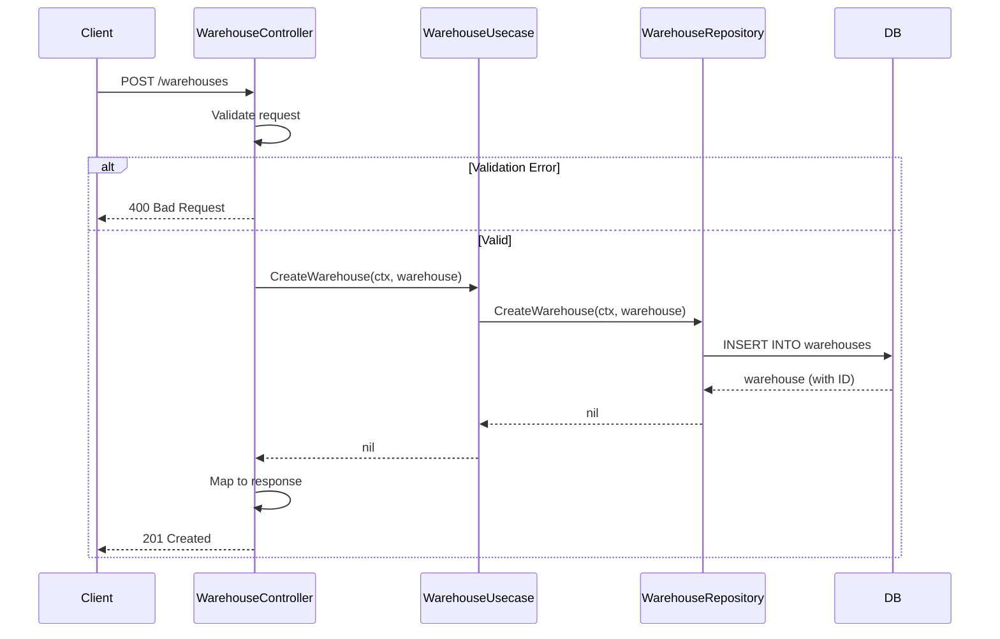
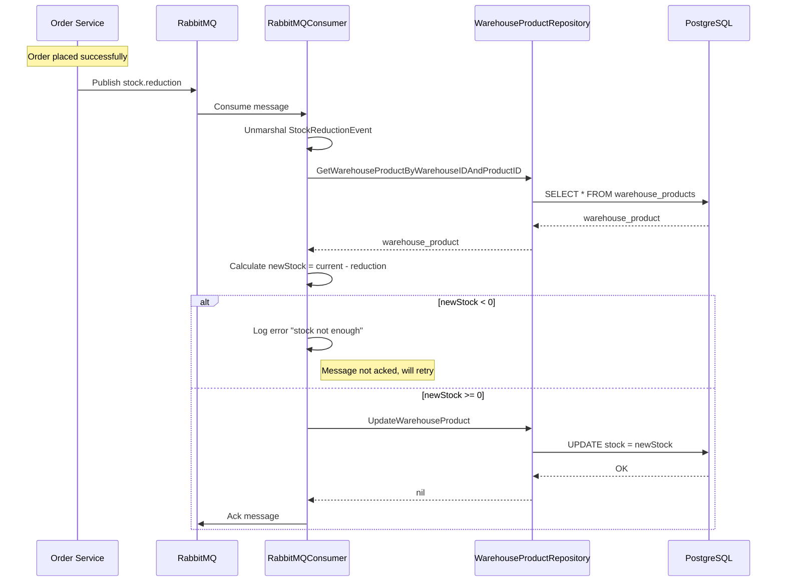
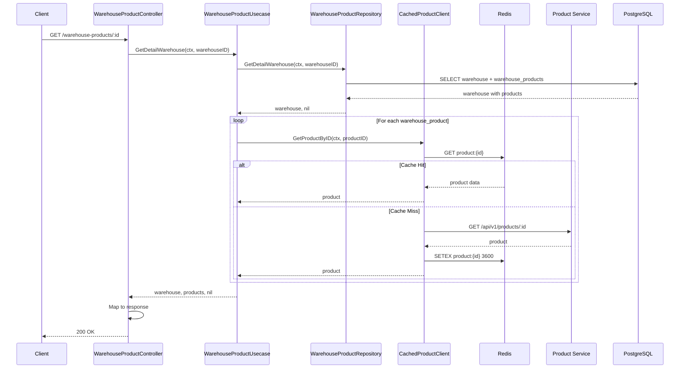

# Warehouse Service Documentation

> Dokumentasi komprehensif untuk microservice Warehouse Service dalam ekosistem Micro-Warehouse.

---

## Daftar Isi

- [1. Executive Summary](#1-executive-summary)
  - [1.1 Tujuan Service](#11-tujuan-service)
  - [1.2 Tech Stack](#12-tech-stack)
  - [1.3 Arsitektur Pattern](#13-arsitektur-pattern)
- [2. Project Structure](#2-project-structure)
  - [2.1 Directory Structure](#21-directory-structure)
  - [2.2 Layer Responsibilities](#22-layer-responsibilities)
  - [2.3 Architecture Flow](#23-architecture-flow)
- [3. Domain Knowledge](#3-domain-knowledge)
  - [3.1 Entity Relationship Diagram](#31-entity-relationship-diagram)
  - [3.2 Business Rules](#32-business-rules)
- [4. API Documentation](#4-api-documentation)
  - [4.1 Warehouse Endpoints](#41-warehouse-endpoints)
  - [4.2 Warehouse Product Endpoints](#42-warehouse-product-endpoints)
  - [4.3 Upload Endpoints](#43-upload-endpoints)
  - [4.4 Request/Response Schema](#44-requestresponse-schema)
  - [4.5 Error Handling](#45-error-handling)
- [5. External Integrations](#5-external-integrations)
  - [5.1 System Integration Architecture](#51-system-integration-architecture)
  - [5.2 Product Service (HTTP + Cache)](#52-product-service-http--cache)
  - [5.3 RabbitMQ Consumer](#53-rabbitmq-consumer)
  - [5.4 Supabase Storage](#54-supabase-storage)
  - [5.5 PostgreSQL & Redis](#55-postgresql--redis)
- [6. Dependency Injection](#6-dependency-injection)
  - [6.1 Container Structure](#61-container-structure)
  - [6.2 DI Flow Diagram](#62-di-flow-diagram)
- [7. Configuration](#7-configuration)
  - [7.1 Environment Variables](#71-environment-variables)
  - [7.2 Config Structure](#72-config-structure)
- [8. Data Flow & Sequence](#8-data-flow--sequence)
  - [8.1 Create Warehouse Flow](#81-create-warehouse-flow)
  - [8.2 Stock Reduction via RabbitMQ](#82-stock-reduction-via-rabbitmq)
  - [8.3 Get Warehouse Detail with Products](#83-get-warehouse-detail-with-products)
- [9. Development Guide](#9-development-guide)
  - [9.1 Local Setup](#91-local-setup)
  - [9.2 Database Migration](#92-database-migration)
  - [9.3 Adding New Feature](#93-adding-new-feature)
  - [9.4 Project Conventions](#94-project-conventions)
- [10. Troubleshooting](#10-troubleshooting)
  - [10.1 Common Issues](#101-common-issues)
  - [10.2 Debug Guide](#102-debug-guide)

---

## 1. Executive Summary

### 1.1 Tujuan Service

Warehouse Service adalah microservice yang bertanggung jawab atas:

| Fungsi | Deskripsi |
|--------|-----------|
| **Warehouse Management** | CRUD operasi untuk data gudang (nama, alamat, telepon, foto) |
| **Stock Management** | Mengelola stok produk di setiap gudang |
| **Stock Synchronization** | Mengurangi stok otomatis via RabbitMQ saat terjadi transaksi |
| **Product Aggregation** | Mengambil data produk dari Product Service dengan caching |
| **File Upload** | Upload foto gudang ke Supabase Storage |

### 1.2 Tech Stack

| Layer | Technology |
|-------|------------|
| **Framework** | Go 1.24.7 + Fiber v2 |
| **Database** | PostgreSQL (GORM) |
| **Cache** | Redis |
| **Message Queue** | RabbitMQ |
| **Storage** | Supabase Storage |
| **Config** | Viper |
| **CLI** | Cobra |
| **Logging** | Zerolog |
| **Validation** | go-playground/validator |

### 1.3 Arsitektur Pattern

Service ini mengimplementasikan **Layered Architecture** (Clean Architecture sederhana) dengan pemisahan:

- **Controller** → HTTP handler, request/response DTO
- **Usecase** → Business logic
- **Repository** → Data access layer
- **Model** → Domain entities

---

## 2. Project Structure

### 2.1 Directory Structure

```
warehouse-service/
├── cmd/                          # Entry point (Cobra CLI)
│   ├── root.go                   # Root command definition
│   └── start.go                  # Start server command
├── app/                          # Application bootstrap
│   ├── app.go                    # Server initialization & lifecycle
│   ├── routes.go                 # Route definitions
│   └── container.go              # Dependency Injection container
├── configs/                      # Configuration management
│   └── config.go                 # Config struct & Viper setup
├── controller/                   # HTTP Handlers (Presentation Layer)
│   ├── request/                  # Request DTOs
│   ├── response/                 # Response DTOs
│   ├── warehouse_controller.go
│   ├── warehouse_product_controller.go
│   └── upload_controller.go
├── usecase/                      # Business Logic Layer
│   ├── warehouse_usecase.go
│   └── warehouse_product_usecase.go
├── repository/                   # Data Access Layer
│   ├── warehouse_repository.go
│   └── warehouse_product_repository.go
├── model/                        # Domain Models
│   ├── warehouse_model.go
│   └── warehouse_product_model.go
├── database/                     # Database connection
│   └── postgres_database.go
├── pkg/                          # Shared packages
│   ├── storage/                  # Supabase Storage integration
│   ├── redis/                    # Redis client
│   ├── rabbitmq/                 # RabbitMQ consumer
│   ├── httpclient/               # External HTTP clients
│   ├── validator/                # Request validation
│   ├── pagination/               # Pagination helper
│   └── conv/                     # Type conversion
├── main.go                       # Application entry point
├── go.mod
└── .env                          # Environment variables
```

### 2.2 Layer Responsibilities

| Layer | Responsibility | Contoh |
|-------|---------------|--------|
| **Controller** | Handle HTTP request/response, validation, parsing | `warehouse_controller.go` |
| **Usecase** | Business logic, orchestrate repositories | `warehouse_usecase.go` |
| **Repository** | Database operations (CRUD) | `warehouse_repository.go` |
| **Model** | Domain entities & relationships | `warehouse_model.go` |
| **Pkg** | Shared utilities & external integrations | `redis/`, `rabbitmq/`, dll |

### 2.3 Architecture Flow



---

## 3. Domain Knowledge

### 3.1 Entity Relationship Diagram



**Keterangan:**
- `WAREHOUSE` menyimpan data master gudang
- `WAREHOUSE_PRODUCT` adalah junction table dengan additional field `stock`
- `PRODUCT` adalah external entity (managed by Product Service)

### 3.2 Business Rules

| Rule | Deskripsi |
|------|-----------|
| **Unique Constraint** | Kombinasi `warehouse_id` + `product_id` harus unik |
| **Upsert Pattern** | Jika produk sudah ada di gudang, update stock (jangan duplicate) |
| **Stock Validation** | Stock tidak boleh negatif saat pengurangan via RabbitMQ |
| **Soft Delete** | Semua entity menggunakan soft delete (deleted_at) |
| **Cascade Read** | Ambil product detail dari Product Service dengan Redis cache |

---

## 4. API Documentation

Base URL: `http://localhost:8083/api/v1`

### 4.1 Warehouse Endpoints

| Method | Endpoint | Deskripsi |
|--------|----------|-----------|
| POST | `/warehouses` | Create warehouse baru |
| GET | `/warehouses` | List semua warehouse (dengan pagination) |
| GET | `/warehouses/:id` | Get warehouse by ID |
| PUT | `/warehouses/:id` | Update warehouse |
| DELETE | `/warehouses/:id` | Soft delete warehouse |

### 4.2 Warehouse Product Endpoints

| Method | Endpoint | Deskripsi |
|--------|----------|-----------|
| POST | `/warehouse-products/:warehouse_id` | Add product ke warehouse |
| GET | `/warehouse-products/:warehouse_id` | Get warehouse detail dengan products |
| GET | `/warehouse-products/:warehouse_id/detail/:product_id` | Get specific product di warehouse |
| PUT | `/warehouse-products/detail/:warehouse_product_id` | Update stock warehouse product |
| DELETE | `/warehouse-products/detail/:warehouse_product_id` | Remove product dari warehouse |
| DELETE | `/warehouse-products/detail/products/:product_id` | Remove product dari semua warehouse |
| GET | `/warehouse-products/detail/products/:product_id/total-stock` | Get total stock product |
| GET | `/warehouse-products/detail/products/:product_id` | Get semua warehouse yang punya product |
| GET | `/warehouse-products/detail/products/:product_id/warehouses` | Get detail warehouse product |

### 4.3 Upload Endpoints

| Method | Endpoint | Deskripsi |
|--------|----------|-----------|
| POST | `/upload-warehouse` | Upload foto warehouse ke Supabase |

### 4.4 Request/Response Schema

#### Create Warehouse

**Request:**
```json
{
  "name": "Gudang Jakarta",
  "address": "Jl. Sudirman No. 123, Jakarta",
  "phone": "08123456789",
  "photo": "https://ikowborhuhawxgpoxcxs.supabase.co/storage/v1/object/public/bwa-warehouse/warehouse-123.jpg"
}
```

**Response (201):**
```json
{
  "id": 1,
  "name": "Gudang Jakarta",
  "address": "Jl. Sudirman No. 123, Jakarta",
  "phone": "08123456789",
  "photo": "https://...",
  "count_product": 0
}
```

#### Get All Warehouses (with Pagination)

**Query Parameters:**
- `page` (int, optional, default: 1)
- `limit` (int, optional, default: 10, max: 100)
- `search` (string, optional) - search by name/address
- `sort_by` (string, optional, enum: id, name, address, phone, created_at)
- `sort_order` (string, optional, enum: asc, desc)

**Response (200):**
```json
{
  "warehouses": [
    {
      "id": 1,
      "name": "Gudang Jakarta",
      "address": "Jl. Sudirman No. 123",
      "phone": "08123456789",
      "photo": "https://...",
      "count_product": 5
    }
  ],
  "pagination": {
    "current_page": 1,
    "total_pages": 5,
    "total_items": 50,
    "items_per_page": 10
  }
}
```

#### Create Warehouse Product

**Request:**
```json
{
  "product_id": 10,
  "stock": 100
}
```

**Behavior:** Jika product sudah ada di warehouse, stock akan di-update (upsert).

#### Get Warehouse Detail with Products

**Response (200):**
```json
{
  "id": 1,
  "name": "Gudang Jakarta",
  "address": "Jl. Sudirman No. 123",
  "phone": "08123456789",
  "photo": "https://...",
  "warehouse_products": [
    {
      "id": 1,
      "warehouse_id": 1,
      "product_id": 10,
      "product_name": "Laptop ASUS",
      "product_about": "Laptop gaming high-end",
      "product_photo": "https://...",
      "product_price": 15000000,
      "product_category": "Elektronik",
      "product_category_photo": "https://...",
      "stock": 100,
      "warehouse": { ... }
    }
  ]
}
```

### 4.5 Error Handling

| Status Code | Meaning | Contoh |
|-------------|---------|--------|
| 400 | Bad Request | Validation error |
| 404 | Not Found | Warehouse/Product tidak ditemukan |
| 500 | Internal Server Error | Database error, External service error |

**Error Response Format:**
```json
{
  "error": "error message",
  "message": "human readable message"
}
```

---

## 5. External Integrations

### 5.1 System Integration Architecture



### 5.2 Product Service (HTTP + Cache)

**Location:** `pkg/httpclient/`

**Pattern:** Cache-Aside dengan Redis



**Cache Duration:** 1 hour (`1 * time.Hour`)

**Endpoints Called:**
- `GET /api/v1/products/:id` - Get product by ID
- `GET /api/v1/products` - List products
- `GET /health` - Health check

**Product Response Structure:**
```go
type ProductResponse struct {
    ID        uint
    Name      string
    About     string
    Price     int64
    Barcode   string
    Thumbnail string
    Category  struct {
        ID    uint
        Name  string
        Photo string
    }
}
```

### 5.3 RabbitMQ Consumer

**Location:** `pkg/rabbitmq/rabbitmq_consumer.go`

**Purpose:** Listen stock reduction events dari order service

**Configuration:**
```go
const (
    ExchangeName = "warehouse_events"
    QueueName    = "stock_reduction_queue"
    RoutingKey   = "stock.reduction"
)
```

**Event Schema:**
```json
{
  "warehouse_id": 1,
  "product_id": 10,
  "stock": 5,
  "merchant_id": 1,
  "timestamp": "2026-02-14T10:00:00Z"
}
```

**Behavior:**
1. Consume message dari queue
2. Cari warehouse_product berdasarkan warehouse_id + product_id
3. Kurangi stock: `newStock = currentStock - event.Stock`
4. Validasi: `newStock >= 0`
5. Update database
6. Ack message

**Sequence Diagram:**



### 5.4 Supabase Storage

**Location:** `pkg/storage/`

**Purpose:** Upload foto warehouse

**Configuration:**
- URL: `SUPABASE_URL`
- Key: `SUPABASE_KEY`
- Bucket: `bwa-warehouse`

**Flow:**
1. Client upload file ke endpoint `/upload-warehouse`
2. Validasi file (type, size)
3. Generate unique filename
4. Upload ke Supabase Storage
5. Return public URL

### 5.5 PostgreSQL & Redis

**PostgreSQL:**
- **Driver:** GORM with pgx
- **Connection Pool:** Max 100 open, 20 idle
- **Features:** Soft delete, auto-migration

**Redis:**
- **Library:** go-redis v9
- **Usage:** Product data caching
- **Key Pattern:** `product:{id}`

---

## 6. Dependency Injection

### 6.1 Container Structure

**Location:** `app/container.go`

```go
type Container struct {
    WarehouseController        controller.WarehouseControllerInterface
    WarehouseProductController controller.WarehouseProductControllerInterface
    UploadController           controller.UploadControllerInterface
    RabbitMQConsumer           *rabbitmq.RabbitMQConsumer
}
```

### 6.2 DI Flow Diagram



**Wiring Order:**
1. Config → Database connections (Postgres, Redis, RabbitMQ)
2. Repositories → Usecases
3. External clients (ProductClient, Supabase)
4. Usecases → Controllers
5. RabbitMQConsumer (background worker)

---

## 7. Configuration

### 7.1 Environment Variables

| Variable | Required | Default | Description |
|----------|----------|---------|-------------|
| `APP_ENV` | Yes | `development` | Environment mode |
| `APP_PORT` | Yes | `8083` | HTTP server port |
| `DATABASE_HOST` | Yes | `localhost` | PostgreSQL host |
| `DATABASE_PORT` | Yes | `5437` | PostgreSQL port |
| `DATABASE_USER` | Yes | `postgres` | PostgreSQL user |
| `DATABASE_PASSWORD` | Yes | - | PostgreSQL password |
| `DATABASE_NAME` | Yes | `warehouse_warehouse_db` | Database name |
| `DATABASE_MAX_OPEN_CONNECTION` | No | `100` | Max open connections |
| `DATABASE_MAX_IDLE_CONNECTION` | No | `20` | Max idle connections |
| `RABBITMQ_HOST` | Yes | `localhost` | RabbitMQ host |
| `RABBITMQ_PORT` | Yes | `5672` | RabbitMQ port |
| `RABBITMQ_USERNAME` | Yes | `guest` | RabbitMQ user |
| `RABBITMQ_PASSWORD` | Yes | `guest` | RabbitMQ password |
| `REDIS_HOST` | Yes | `localhost` | Redis host |
| `REDIS_PORT` | Yes | `6379` | Redis port |
| `SUPABASE_URL` | Yes | - | Supabase Storage URL |
| `SUPABASE_KEY` | Yes | - | Supabase service role key |
| `SUPABASE_BUCKET` | Yes | `bwa-warehouse` | Storage bucket name |
| `URL_PRODUCT_SERVICE` | Yes | - | Product Service base URL |

### 7.2 Config Structure

```go
type Config struct {
    App      App
    SqlDB    SqlDB
    Redis    Redis
    RabbitMQ RabbitMQ
    Supabase Supabase
}

type App struct {
    AppPort           string
    AppEnv            string
    UrlProductService string
}

type SqlDB struct {
    Host           string
    Port           string
    User           string
    Password       string
    DBName         string
    DBMaxOpenConns int
    DBMaxIdleConns int
}
```

---

## 8. Data Flow & Sequence

### 8.1 Create Warehouse Flow



### 8.2 Stock Reduction via RabbitMQ



### 8.3 Get Warehouse Detail with Products



---

## 9. Development Guide

### 9.1 Local Setup

**Prerequisites:**
- Go 1.24.7+
- PostgreSQL 14+
- Redis 7+
- RabbitMQ 3.11+

**Steps:**

```bash
# 1. Clone repository
git clone <repo-url>
cd warehouse-service

# 2. Install dependencies
go mod download

# 3. Setup environment
cp .env.example .env
# Edit .env sesuai konfigurasi lokal

# 4. Run database migrations (manual atau via tool)
# Pastikan database warehouse_warehouse_db sudah ada

# 5. Start server
go run main.go start

# Atau build terlebih dahulu
go build -o warehouse-service
./warehouse-service start
```

### 9.2 Database Migration

Service ini menggunakan **GORM Auto Migration**. Pastikan database sudah dibuat sebelumnya.

```go
// In postgres_database.go
db.AutoMigrate(
    &model.Warehouse{},
    &model.WarehouseProduct{},
)
```

**Manual Migration (jika diperlukan):**

```sql
-- Create warehouses table
CREATE TABLE warehouses (
    id SERIAL PRIMARY KEY,
    name VARCHAR(100) NOT NULL,
    address TEXT,
    photo TEXT,
    phone VARCHAR(20) NOT NULL,
    created_at TIMESTAMP DEFAULT CURRENT_TIMESTAMP,
    updated_at TIMESTAMP,
    deleted_at TIMESTAMP
);

-- Create warehouse_products table
CREATE TABLE warehouse_products (
    id SERIAL PRIMARY KEY,
    warehouse_id INTEGER NOT NULL REFERENCES warehouses(id),
    product_id INTEGER NOT NULL,
    stock INTEGER NOT NULL DEFAULT 0,
    created_at TIMESTAMP DEFAULT CURRENT_TIMESTAMP,
    updated_at TIMESTAMP,
    deleted_at TIMESTAMP
);

-- Indexes
CREATE INDEX idx_warehouse_products_warehouse_id ON warehouse_products(warehouse_id);
CREATE INDEX idx_warehouse_products_product_id ON warehouse_products(product_id);
CREATE INDEX idx_warehouses_deleted_at ON warehouses(deleted_at);
CREATE INDEX idx_warehouse_products_deleted_at ON warehouse_products(deleted_at);
```

### 9.3 Adding New Feature

**Pattern untuk menambahkan fitur baru (contoh: Warehouse Transfer):**

```
1. Model (model/warehouse_transfer_model.go)
   └── Definisikan struct WarehouseTransfer

2. Repository (repository/warehouse_transfer_repository.go)
   └── Implementasi interface: CreateTransfer, GetTransfers, dll

3. Usecase (usecase/warehouse_transfer_usecase.go)
   └── Business logic: validasi stock, transfer logic

4. Controller (controller/warehouse_transfer_controller.go)
   └── HTTP handlers

5. Request/Response DTOs
   └── controller/request/warehouse_transfer_request.go
   └── controller/response/warehouse_transfer_response.go

6. Routes (app/routes.go)
   └── Tambahkan route baru

7. Container (app/container.go)
   └── Wire dependency baru
```

**Contoh kode skeleton:**

```go
// model/warehouse_transfer_model.go
type WarehouseTransfer struct {
    ID              uint      `gorm:"primaryKey"`
    FromWarehouseID uint      `gorm:"not null"`
    ToWarehouseID   uint      `gorm:"not null"`
    ProductID       uint      `gorm:"not null"`
    Quantity        int       `gorm:"not null"`
    Status          string    `gorm:"not null;default:'pending'"`
    CreatedAt       time.Time
    UpdatedAt       *time.Time
}
```

### 9.4 Project Conventions

**Naming Convention:**

| Element | Convention | Contoh |
|---------|------------|--------|
| File | snake_case | `warehouse_controller.go` |
| Struct | PascalCase | `WarehouseController` |
| Interface | PascalCase + Interface suffix | `WarehouseControllerInterface` |
| Method | PascalCase (exported), camelCase (unexported) | `CreateWarehouse`, `validateRequest` |
| Variable | camelCase | `warehouseRepo` |
| Constant | CamelCase atau SCREAMING_SNAKE | `ExchangeName` |

**Error Handling:**
- Selalu log error dengan context: `log.Errorf("[Package] Method - step: %v", err)`
- Return error ke layer atas untuk handling terpusat
- Gunakan `fiber.Err*` untuk HTTP-specific errors

**Logging:**
- Format: `[PackageName] MethodName - stepNumber: error`
- Contoh: `[WarehouseProductUsecase] GetDetailWarehouse - 1: record not found`

**Context Usage:**
- Selalu pass `context.Context` ke repository dan external calls
- Gunakan `context.WithTimeout` untuk operations yang mungkin lambat

---

## 10. Troubleshooting

### 10.1 Common Issues

| Issue | Cause | Solution |
|-------|-------|----------|
| `connection refused` PostgreSQL | Database belum running atau config salah | Cek PostgreSQL status dan env vars |
| `dial tcp: connect: connection refused` RabbitMQ | RabbitMQ belum running | Start RabbitMQ service |
| `product not found` | Product Service down | Cek Product Service health dan URL config |
| `stock not enough` | Stock kurang untuk pengurangan | Cek stock di database atau order quantity |
| `timeout` | External service lambat | Tingkatkan timeout atau cek network |
| `invalid memory address` | Dependency belum di-inject | Cek Container wiring di `app/container.go` |

### 10.2 Debug Guide

**Enable Debug Logging:**

```go
// Di app.go, tambahkan sebelum server start
zerolog.SetGlobalLevel(zerolog.DebugLevel)
```

**Check Database Connection:**

```bash
# Test PostgreSQL
psql -h localhost -p 5437 -U postgres -d warehouse_warehouse_db

# Test Redis
redis-cli -h localhost -p 6379 ping

# Test RabbitMQ
curl http://localhost:15672/api/overview -u guest:guest
```

**Check Service Health:**

```bash
# Cek API running
curl http://localhost:8083/api/v1/warehouses

# Cek Product Service
curl http://localhost:8082/health
```

**Trace Request Flow:**

1. **Controller:** Log request body dan validation errors
2. **Usecase:** Log business logic steps
3. **Repository:** Log SQL queries (enable GORM debug mode)
4. **External Calls:** Log request/response ke Product Service

```go
// Enable GORM debug mode
db = db.Debug()  // Log semua SQL queries
```

---

## Appendix

### Glossary

| Term | Definition |
|------|------------|
| **Warehouse** | Gudang fisik untuk menyimpan produk |
| **WarehouseProduct** | Relasi antara Warehouse dan Product dengan stock |
| **Stock Reduction** | Pengurangan stok saat terjadi order |
| **Cache-Aside** | Pattern caching: cek cache dulu, jika miss ambil dari DB dan cache |
| **Soft Delete** | Penghapusan logic dengan mengisi deleted_at |
| **Upsert** | Update jika ada, insert jika tidak ada |

### References

- [Fiber Documentation](https://docs.gofiber.io/)
- [GORM Documentation](https://gorm.io/docs/)
- [RabbitMQ Go Tutorial](https://www.rabbitmq.com/tutorials/tutorial-one-go.html)
- [Supabase Storage](https://supabase.com/docs/guides/storage)

---

*Dokumentasi ini di-generate pada 14 Februari 2026. Untuk update terbaru, cek repository atau hubungi tim development.*
